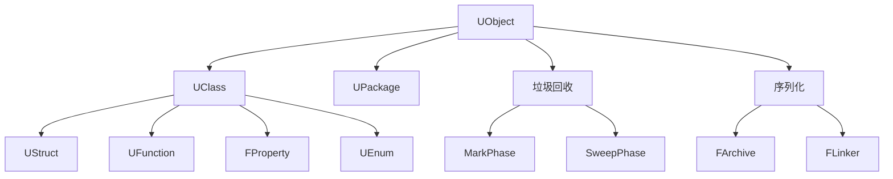

# CoreUObject 模块详解

## 摘要

CoreUObject 是 UE5.7.4 的反射和对象系统核心，实现了 UObject 基类、UClass 元数据、UFunction 反射调用、FProperty 属性系统、垃圾回收（GC）、序列化、以及 Package 管理。所有 UE 的托管对象都继承自 UObject，由 CoreUObject 管理生命周期。

---

## 1. 模块定位

CoreUObject 在 Core 之上构建了完整的对象模型：
- **反射系统**: 运行时类型信息（RTTI 替代）
- **对象管理**: 创建、销毁、生命周期
- **垃圾回收**: 标记-清除 GC，自动管理对象生命周期
- **序列化**: 二进制/JSON/标签式序列化
- **属性系统**: FProperty 支持运行时读写任意属性

---

## 2. 所在路径

- **Public**: `Engine/Source/Runtime/CoreUObject/Public/UObject/`
- **Private**: `Engine/Source/Runtime/CoreUObject/Private/UObject/`
- **Build.cs**: `Engine/Source/Runtime/CoreUObject/CoreUObject.Build.cs`

---

## 3. Build.cs 依赖关系

### 公共依赖
- `Core`

### 私有依赖
- `ApplicationCore`, `DerivedDataCache`, `IoStoreOnDemand`

---

## 4. Public API 关键类

| 类 | 文件 | 职责 |
|----|------|------|
| `UObject` | `UObject.h` | 所有托管对象基类 |
| `UClass` | `Class.h` | 类元数据（反射） |
| `UStruct` | `Struct.h` | 结构体元数据 |
| `UFunction` | `Function.h` | 函数反射 |
| `FProperty` | `UnrealType.h` | 属性基类 |
| `FObjectProperty` | `UnrealType.h` | UObject 指针属性 |
| `FStructProperty` | `UnrealType.h` | 结构体属性 |
| `UEnum` | `Enum.h` | 枚举反射 |
| `UPackage` | `Package.h` | 资源包 |
| `FLinkerTables` | `LinkerTables.h` | 序列化链接器 |

---

## 5. 关键函数

| 函数 | 文件 | 作用 |
|------|------|------|
| `StaticConstructObject_Internal()` | `UObjectGlobals.cpp` | 创建 UObject |
| `NewObject<T>()` | `UObjectGlobals.h` | 模板化对象创建 |
| `UObject::ConditionalBeginDestroy()` | `UObject.cpp` | 延迟销毁 |
| `UObject::Serialize()` | `Obj.cpp` | 序列化入口 |
| `CollectGarbage()` | `GarbageCollection.cpp` | 执行 GC |
| `UClass::GetDefaultObject()` | `Class.cpp` | 获取类默认对象（CDO） |
| `UFunction::Invoke()` | `Function.h` | 反射调用函数 |

---

## 6. 初始化流程

```
FEngineLoop::Init()
  │
  └─ FModuleManager::LoadModule("CoreUObject")
      └─ FCoreUObjectModule::StartupModule()
          ├─ UObject::StaticClass() — 初始化所有静态类
          ├─ UField::StaticClass() — 字段元数据
          ├─ UClass::StaticClass() — 类元数据
          └─ InitializeIntrinsicClass() — 内建类注册
```

---

## 7. 运行时调用链

### 对象创建
```
NewObject<UMyClass>(Outer, Class, Name, Flags)
  └─ StaticConstructObject_Internal()
      ├─ AllocateUObject() — 从 GC 系统分配
      ├─ UObject::InitProperties() — 初始化属性到 CDO 默认值
      ├─ UObject::PostInitProperties() — 初始化后回调
      └─ 返回新对象
```

### 垃圾回收
```
CollectGarbage(GarbageCollectionKeepFlags)
  ├─ MarkPhase — 标记可达对象
  │   ├─ 根集合遍历
  │   ├─ TObjectPtr 属性追踪
  │   └─ 增量标记
  ├─ SweepPhase — 清除不可达对象
  │   └─ 条件析构
  └─ FinishPhase — 完成回收
```

### 反射调用
```
UFunction* Func = Class->FindFunction(FName("MyFunc"));
Func->Invoke(Object, Params, Stack)
  ├─ [Blueprint] ProcessInternal() — 蓝图虚拟机执行
  └─ [Native] 直接调用 C++ 函数指针
```

---

## 8. 与其他模块的关系

```
Core ← CoreUObject ← Engine ← Renderer, UnrealEd, ...
CoreUObject → Core (基础类型)
Engine → CoreUObject (UObject 子类定义)
UMG → CoreUObject (UWidget 继承 UObject)
```

---

## 9. 常见扩展点

1. **自定义 UObject 子类**: 使用 `UCLASS()` 宏标记
2. **自定义属性**: 继承 `FProperty` 添加新属性类型
3. **自定义序列化**: 重写 `Serialize()` 方法
4. **GC 控制**: `UPROPERTY()` 标记指针让 GC 追踪，`AddReferencedObjects` 添加引用

---

## 10. 常见错误与调试

- **UObject 泄漏**: 检查是否缺少 `UPROPERTY()` 导致 GC 无法追踪
- **访问已销毁对象**: 使用 `IsValid()` 或 `TStrongObjectPtr` 检查有效性
- **循环引用**: `UPROPERTY` 指针形成循环会阻止 GC，使用 `TWeakObjectPtr` 打破
- **CDO 污染**: 不要修改 CDO 属性，它会影响所有实例

---

## 11. Mermaid 调用图



---

## 12. 源码证据

- `Engine/Source/Runtime/CoreUObject/Public/UObject/UObject.h` — UObject 基类
- `Engine/Source/Runtime/CoreUObject/Public/UObject/Class.h` — UClass 定义
- `Engine/Source/Runtime/CoreUObject/Public/UObject/UnrealType.h` — FProperty 体系
- `Engine/Source/Runtime/CoreUObject/Private/UObject/GarbageCollection.cpp` — GC 实现
- `Engine/Source/Runtime/CoreUObject/Private/UObject/Obj.cpp` — UObject 核心实现
- `Engine/Source/Runtime/CoreUObject/CoreUObject.Build.cs` — 依赖定义

---

## 13. 相关文档

- [Core 模块详解](Core.md)
- [04_CORE_OBJECT_SYSTEM/UObject.md](../04_CORE_OBJECT_SYSTEM/UObject.md)
- [04_CORE_OBJECT_SYSTEM/GC.md](../04_CORE_OBJECT_SYSTEM/GC.md)
- [04_CORE_OBJECT_SYSTEM/UClass_Reflection.md](../04_CORE_OBJECT_SYSTEM/UClass_Reflection.md)
