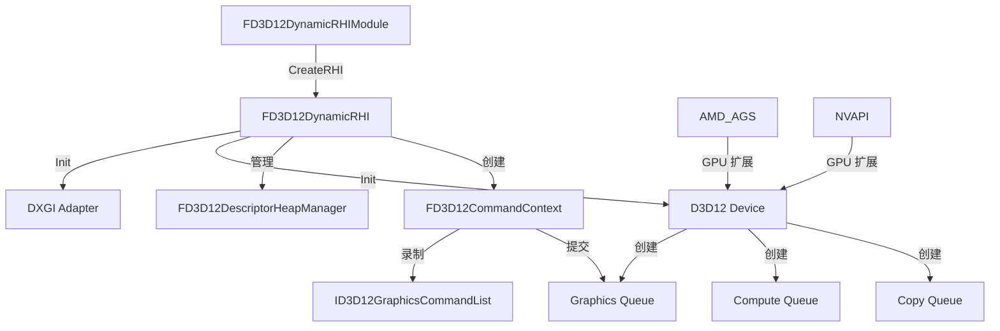

# D3D12RHI

## 摘要
DirectX 12 渲染后端实现：将引擎 RHI 抽象映射到 D3D12 API，管理命令队列/描述符堆/资源屏障/异步计算管线。

## 1. 模块定位
D3D12RHI 是 Windows/Xbox 平台的主要 GPU 后端。它实现了 `FDynamicRHI` 接口，将引擎的 RHI 抽象调用翻译为 D3D12 API 调用。关键特性包括：显式资源屏障管理、描述符堆池化、异步计算队列、GPU 端资源上传/读回、光追加速结构管理。

## 2. 所在路径
```
Engine/Source/Runtime/D3D12RHI/
├── Private/
│   ├── D3D12Adapter.cpp/h          (GPU 适配器/设备)
│   ├── D3D12Device.cpp/h           (D3D12 Device 封装)
│   ├── D3D12CommandContext.cpp/h    (命令上下文/队列)
│   ├── D3D12Resource.cpp/h         (ID3D12Resource 封装)
│   ├── D3D12DescriptorHeapManager.cpp/h (描述符堆管理)
│   ├── D3D12Buffer.cpp             (缓冲区实现)
│   ├── D3D12Texture.cpp            (纹理实现)
│   ├── D3D12PipelineState.cpp      (PSO 实现)
│   ├── D3D12RayTracing.cpp         (光追)
│   └── D3D12DynamicRHI.cpp/h      (FD3D12DynamicRHI 主类)
├── Public/
│   └── D3D12Thirdparty.h
└── D3D12RHI.Build.cs
```

## 3. Build.cs 依赖关系
```csharp
// D3D12RHI.Build.cs
PublicDependencyModuleNames = { "Core", "RHI" };
PrivateDependencyModuleNames = {
    "CoreUObject", "Engine", "RHICore", "RenderCore", "TraceLog"
};
// 第三方库:
//   AMD_AGS — AMD GPU 扩展
//   DX12 — D3D12 API 头文件
//   IntelExtensionsFramework — Intel GPU 扩展
//   NVAPI — NVIDIA GPU 扩展
//   NVAftermath — NVIDIA 崩溃诊断
// Windows: 额外依赖 HeadMountedDisplay, WinPixEventRuntime
```

## 4. Public API（5个关键类）

| 类 | 文件 | 职责 |
|----|------|------|
| `FD3D12DynamicRHI` | D3D12DynamicRHI.h | FDynamicRHI 的 D3D12 实现 |
| `FD3D12Device` | D3D12Device.h | D3D12 Device + 多队列封装 |
| `FD3D12CommandContext` | D3D12CommandContext.h | 命令列表/分配器/提交管理 |
| `FD3D12Resource` | D3D12Resource.h | ID3D12Resource 的 UE 封装 |
| `FD3D12DescriptorHeapManager` | D3D12DescriptorHeapManager.h | 描述符堆池化分配 |

## 5. 关键函数（含文件路径）

### 5.1 FD3D12DynamicRHI::Init()
```cpp
// D3D12DynamicRHI.cpp
virtual void Init() override;
// 创建 DXGI Factory → 枚举适配器 → CreateDevice → 创建命令队列
```

### 5.2 RHICreateTexture()
```cpp
// 重写: 创建 D3D12 纹理资源
virtual FTextureRHIRef RHICreateTexture(const FRHITextureCreateDesc& Desc) override;
```

### 5.3 RHICreateBuffer()
```cpp
// 重写: 创建 D3D12 缓冲区（上传堆/默认堆/读回堆）
virtual FBufferRHIRef RHICreateBuffer(...) override;
```

### 5.4 FD3D12CommandContext::FlushCommands()
```cpp
// 提交已录制的命令列表到 GPU 队列
void FlushCommands(bool bWaitForCompletion = false);
```

### 5.5 FD3D12DynamicRHIModule::CreateRHI()
```cpp
// 模块工厂方法
virtual FDynamicRHI* CreateRHI() override {
    return new FD3D12DynamicRHI();
}
```

## 6. 初始化流程
```
1. FD3D12DynamicRHIModule::CreateRHI() → new FD3D12DynamicRHI()
2. FD3D12DynamicRHI::Init()
   ├── CreateDXGIFactory2()
   ├── 枚举 GPU 适配器 (IDXGIAdapter)
   ├── D3D12CreateDevice()
   ├── 创建 Command Queues (Graphics/Compute/Copy)
   ├── 创建 Descriptor Heap Manager
   └── 初始化帧资源和上传缓冲区
```

## 7. 与其他模块的关系
```
RHI (抽象接口)
  └──> D3D12RHI (Windows/Xbox D3D12 实现)
         ├──> RenderCore (Shader 编译反馈)
         ├──> Engine (SwapChain 创建)
         └──> 第三方: AMD_AGS, NVAPI, NVAftermath
```

## 8. 常见扩展点
- **自定义描述符管理**：扩展 `FD3D12DescriptorHeapManager`
- **资源屏障优化**：通过 `D3D12BarrierBatch` 批量提交屏障
- **GPU 崩溃调试**：集成 NVAftermath 自动抓取崩溃上下文
- **PIX 性能分析**：`PROFILE` 宏启用 WinPixEventRuntime 标记

## 9. Mermaid 调用图


## 10. 源码证据
- `D3D12RHI.Build.cs:7`：`[SupportedPlatformGroups("Microsoft")]`，仅微软平台
- `D3D12RHI.Build.cs:30-34`：第三方库 AMD_AGS, DX12, NVAPI, NVAftermath
- `D3D12RHI.Build.cs:42-49`：PIX 性能分析集成（非 Shipping 构建）
- `Private/D3D12DynamicRHI.cpp`：Init() 创建完整的 D3D12 设备栈

## 11. 相关文档
- `UE5_知识树.txt` — B.渲染层 / D3D12RHI 模块
- Microsoft 文档: DirectX 12 Programming Guide
