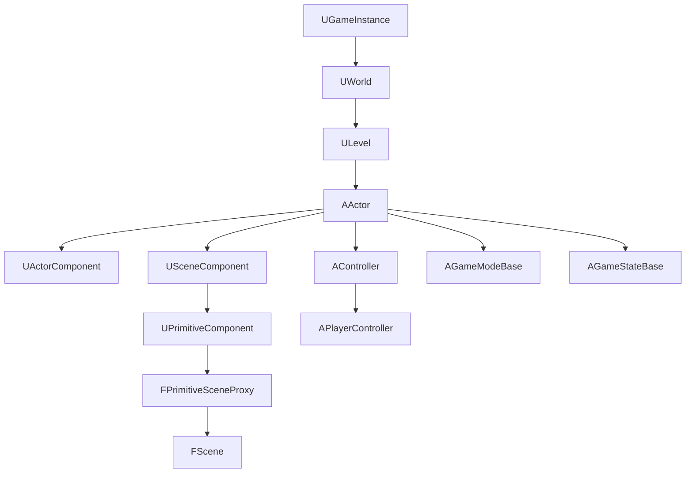

# Engine 模块详解

## 摘要

Engine 模块是 UE5.7.4 的核心运行时模块，定义了游戏世界的基础类型：AActor、UActorComponent、UWorld、AGameMode、APlayerController、AController 等。它是 Gameplay Framework 的实现基础，同时包含动画、物理、音频、网络、AI 等系统的运行时接口。

---

## 1. 模块定位

Engine 模块是 Gameplay Framework 的核心实现：
- **World/Level 管理**: UWorld, ULevel, 流送系统
- **Actor/Component**: AActor, UActorComponent 及其子类
- **Gameplay Framework**: AGameMode, APlayerController, AGameState
- **动画**: USkeletalMeshComponent, UAnimInstance
- **物理**: UPrimitiveComponent 碰撞和物理
- **音频**: UAudioComponent
- **网络**: 复制系统（Replication）运行时

---

## 2. 所在路径

- **Public**: `Engine/Source/Runtime/Engine/Public/`
- **Classes**: `Engine/Source/Runtime/Engine/Classes/` (UHT 生成的头文件)
- **Private**: `Engine/Source/Runtime/Engine/Private/`
- **Build.cs**: `Engine/Source/Runtime/Engine/Engine.Build.cs`

---

## 3. Build.cs 依赖关系

### 公共依赖
- `Core`, `CoreUObject`, `ApplicationCore`
- `RuntimePhysXCooking`, `ClothingSystemRuntimeInterface`

### 私有依赖
- `RenderCore`, `RHI`, `Renderer`, `EngineSettings`
- `AnimGraphRuntime`, `MovieScene`, `SlateCore`, `Slate`, `UMG`
- `NavigationSystem`, `AIModule`, `MeshDescription`
- `NetworkReplayStreaming`, `PacketHandler`
- `AudioMixer`, `AudioEditor` (Editor only)
- `UnrealEd`, `AssetTools`, `GraphEditor` (Editor only)

---

## 4. Public API 关键类

| 类 | 文件 | 职责 |
|----|------|------|
| `AActor` | `GameFramework/Actor.h` | 所有可放置实体的基类 |
| `UActorComponent` | `Components/ActorComponent.h` | 组件基类 |
| `UPrimitiveComponent` | `Components/PrimitiveComponent.h` | 可渲染/碰撞组件 |
| `USceneComponent` | `Components/SceneComponent.h` | 带变换的组件 |
| `UWorld` | `Engine/World.h` | 游戏世界容器 |
| `ULevel` | `Engine/Level.h` | 关卡 |
| `AGameModeBase` | `GameFramework/GameModeBase.h` | 游戏模式 |
| `APlayerController` | `GameFramework/PlayerController.h` | 玩家控制器 |
| `UGameInstance` | `Engine/GameInstance.h` | 游戏实例（跨关卡持久） |
| `USkeletalMeshComponent` | `Components/SkeletalMeshComponent.h` | 骨骼网格组件 |

---

## 5. 关键函数

| 函数 | 文件 | 作用 |
|------|------|------|
| `UWorld::Tick()` | `World.cpp` | 世界 Tick 主循环 |
| `AActor::BeginPlay()` | `Actor.cpp` | Actor 开始游戏 |
| `AActor::Tick()` | `Actor.cpp` | Actor 每帧更新 |
| `UWorld::SpawnActor()` | `World.cpp` | 生成 Actor |
| `AActor::Destroy()` | `Actor.cpp` | 销毁 Actor |
| `UActorComponent::RegisterComponent()` | `ActorComponent.cpp` | 组件注册 |
| `UPrimitiveComponent::CreateSceneProxy()` | `PrimitiveComponent.cpp` | 创建渲染代理 |
| `AGameModeBase::InitGameState()` | `GameModeBase.cpp` | 初始化游戏状态 |

---

## 6. 初始化流程

```
FEngineLoop::Init()
  │
  └─ LoadModule("Engine")
      └─ UEngineModule::StartupModule()
          ├─ 初始化类默认对象
          └─ 注册引擎类

GEngine->Init()
  ├─ 创建 UGameInstance
  ├─ 初始化 UWorld
  └─ 启动网络驱动
```

---

## 7. 运行时调用链

### 世界 Tick
```
UWorld::Tick(ETickType, DeltaSeconds)
  ├─ AWorldSettings::Tick() — 世界设置
  ├─ FWorldDelegates::OnWorldTickStart
  ├─ GTickTaskScheduler
  │   ├─ TickActorComponents
  │   │   └─ UActorComponent::TickComponent()
  │   ├─ TickActors
  │   │   └─ AActor::Tick()
  │   └─ TickFunctions (延迟 Tick)
  ├─ TimerManager.Tick()
  ├─ PhysicsScene.Tick()
  ├─ NavigationSystem.Tick()
  └─ FWorldDelegates::OnWorldTickEnd
```

### Actor 生成
```
UWorld::SpawnActor(Class, Transform, SpawnParams)
  ├─ AllocateActor() — 从 GC 分配
  ├─ Actor->PostSpawnInitialize()
  │   ├─ RegisterAllComponents()
  │   └─ UpdateOverlaps()
  ├─ Actor->PostActorCreated()
  └─ Actor->BeginPlay()
```

---

## 8. 与其他模块的关系

```
CoreUObject ← Engine ← Renderer (SceneProxy)
Engine → RenderCore (ENQUEUE_RENDER_COMMAND)
Engine → AIModule (AIController)
Engine → PhysicsCore (物理场景)
Engine → AnimGraphRuntime (动画)
Engine → Net (网络复制)
Engine → Slate/UMG (UI)
```

---

## 9. 常见扩展点

1. **自定义 Actor**: 继承 AActor，重写 BeginPlay/Tick
2. **自定义 Component**: 继承 UActorComponent 或 UPrimitiveComponent
3. **自定义 GameMode**: 继承 AGameModeBase
4. **自定义 SceneProxy**: 重写 CreateSceneProxy() 实现自定义渲染
5. **Subsystem**: 通过 UGameInstanceSubsystem/UWorldSubsystem 扩展

---

## 10. 常见错误与调试

- **Actor 未 Spawn**: 检查是否有 Valid World 和 GameMode
- **Component 未注册**: 确保 RegisterComponent() 被调用
- **Tick 不执行**: 检查 PrimaryActorTick.bCanEverTick 和 SetActorTickEnabled()
- **网络复制失败**: 确保 UPROPERTY(Replicated) 和 GetLifetimeReplicatedProps()

---

## 11. Mermaid 调用图



---

## 12. 源码证据

- `Engine/Source/Runtime/Engine/Classes/GameFramework/Actor.h` — AActor
- `Engine/Source/Runtime/Engine/Classes/Engine/World.h` — UWorld
- `Engine/Source/Runtime/Engine/Classes/Components/ActorComponent.h` — UActorComponent
- `Engine/Source/Runtime/Engine/Classes/GameFramework/GameModeBase.h` — AGameModeBase
- `Engine/Source/Runtime/Engine/Classes/Components/PrimitiveComponent.h` — UPrimitiveComponent
- `Engine/Source/Runtime/Engine/Engine.Build.cs` — 依赖定义

---

## 13. 相关文档

- [Launch 模块详解](Launch.md)
- [CoreUObject 模块详解](CoreUObject.md)
- [05_GAMEPLAY_FRAMEWORK/Actor.md](../05_GAMEPLAY_FRAMEWORK/Actor.md)
- [06_RENDERING/SceneProxy.md](../06_RENDERING/SceneProxy.md)
