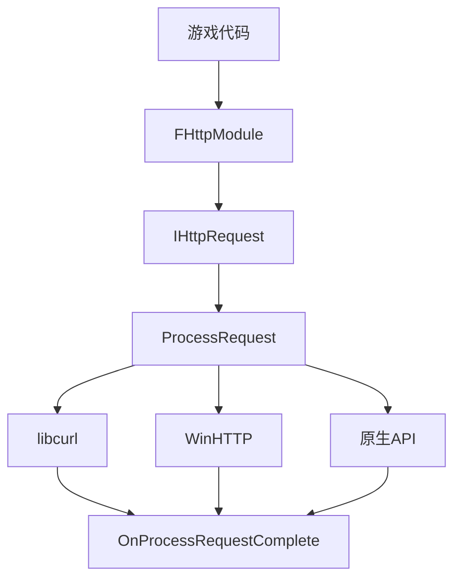

# HTTP 模块详解

## 摘要

HTTP 模块提供平台无关的 HTTP 客户端功能，支持 GET/POST/PUT/DELETE 等 HTTP 方法。底层使用 libcurl（跨平台）、WinHTTP（Windows）或原生平台 API。异步回调模式，不阻塞游戏线程。

---

## 1. 模块定位

HTTP 模块提供：
- 异步 HTTP 请求/响应
- 多平台后端（libcurl, WinHTTP, Apple NSURLConnection）
- SSL/TLS 支持
- 请求头和内容自定义

---

## 2. 所在路径

- **Public**: `Engine/Source/Runtime/Online/HTTP/Public/`
- **Private**: `Engine/Source/Runtime/Online/HTTP/Private/`
- **Build.cs**: `Engine/Source/Runtime/Online/HTTP/HTTP.Build.cs`

---

## 3. Build.cs 依赖关系

### 公共依赖
- `Core`

### 私有依赖
- `EventLoop`, `Sockets`, `SSL`

---

## 4. Public API 关键类

| 类 | 文件 | 职责 |
|----|------|------|
| `IHttpRequest` | `IHttpRequest.h` | HTTP 请求接口 |
| `IHttpResponse` | `IHttpResponse.h` | HTTP 响应接口 |
| `FHttpModule` | `HttpModule.h` | 模块单例，创建请求 |
| `FHttpManager` | `HttpManager.h` | 管理所有活跃请求 |

---

## 5. 关键函数

| 函数 | 文件 | 作用 |
|------|------|------|
| `FHttpModule::CreateRequest()` | `HttpModule.h:71` | 创建 HTTP 请求 |
| `IHttpRequest::ProcessRequest()` | `IHttpRequest.h:355` | 发送请求 |
| `IHttpRequest::SetURL()` | `IHttpRequest.h:198` | 设置 URL |
| `IHttpRequest::SetContent()` | `IHttpRequest.h:222` | 设置请求体 |
| `IHttpResponse::GetResponseCode()` | `IHttpResponse.h:120` | 获取状态码 |
| `IHttpResponse::GetContentAsString()` | `IHttpResponse.h:127` | 获取响应文本 |

---

## 6. 初始化流程

```
FHttpModule::StartupModule()
  ├─ 创建 FHttpManager
  └─ 选择平台后端（Curl/WinHTTP/Apple）
```

---

## 7. 运行时调用链

```
FHttpModule::CreateRequest()
  └─ 返回 IHttpRequest 实例
      ├─ SetURL("https://api.example.com/data")
      ├─ SetVerb("GET")
      ├─ SetHeader("Content-Type", "application/json")
      ├─ OnProcessRequestComplete().BindLambda(...)
      └─ ProcessRequest()
          └─ FHttpManager::Tick() 每帧处理
              └─ 平台后端执行 HTTP 请求
                  └─ 回调 OnProcessRequestComplete
```

---

## 8. 与其他模块的关系

- **依赖**: Sockets, EventLoop, SSL
- **被依赖**: WebSockets, PixelStreaming, OnlineSubsystem

---

## 9. 常见扩展点

1. **自定义请求处理**: 继承 IHttpRequest 实现
2. **自定义平台后端**: 实现 FHttpManager 子类

---

## 10. Mermaid 调用图



---

## 11. 源码证据

- `Engine/Source/Runtime/Online/HTTP/Public/IHttpRequest.h:169` — IHttpRequest
- `Engine/Source/Runtime/Online/HTTP/Public/HttpModule.h:25` — FHttpModule
- `Engine/Source/Runtime/Online/HTTP/HTTP.Build.cs` — 依赖定义

---

## 12. 相关文档

- [WebSockets 模块详解](WebSockets.md)
- [10_NETWORKING/HTTP.md](../10_NETWORKING/HTTP.md)
