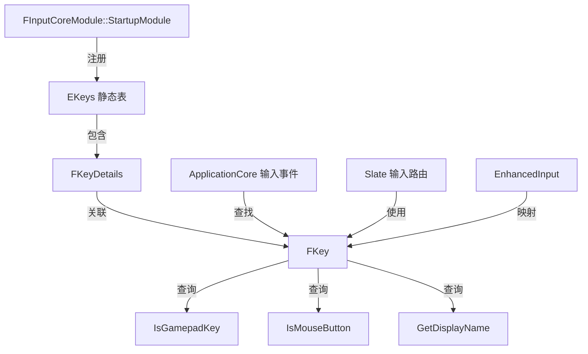

# InputCore

## 摘要
定义输入系统的基础类型：FKey（按键标识）、EKeys（按键枚举）、FKeyDetails（按键元数据）和手柄绑定类型。

## 1. 模块定位
InputCore 是输入系统的最底层模块，提供与具体输入设备无关的按键/轴抽象。所有按键（键盘、鼠标、手柄、触摸）统一表示为 `FKey`。上层模块（ApplicationCore、Slate、EnhancedInput）使用 `FKey` 进行输入映射和事件分发。

## 2. 所在路径
```
Engine/Source/Runtime/InputCore/
├── Public/
│   ├── InputCoreTypes.h     (FKey, EKeys, FKeyDetails 定义)
│   ├── InputCoreModule.h    (模块类)
│   └── GestureDetector.h    (手势检测)
├── Private/
│   ├── InputCoreTypes.cpp   (EKeys 静态注册所有按键)
│   └── InputCoreModule.cpp
└── InputCore.Build.cs
```

## 3. Build.cs 依赖关系
```csharp
// InputCore.Build.cs
PublicDependencyModuleNames = { "Core", "CoreUObject" };
// iOS: 额外引用 ApplicationCore 头文件路径
// Linux: 额外引用 SDL3 头文件路径
```

## 4. Public API（5个关键类）

| 类 | 文件 | 职责 |
|----|------|------|
| `FKey` | InputCoreTypes.h | 按键标识符（轻量值类型，内部 FName） |
| `EKeys` | InputCoreTypes.h | 静态类，包含所有已知按键的 FKey 常量 |
| `FKeyDetails` | InputCoreTypes.h | 按键元数据（游戏手柄？鼠标按钮？显示名） |
| `EControllerHand` | InputCoreTypes.h | 手柄左右手枚举（Left/Right） |
| `FInputCoreModule` | InputCoreModule.h | 模块类，启动时注册所有 EKeys |

## 5. 关键函数（含文件路径）

### 5.1 FKey::IsValid()
```cpp
// Public/InputCoreTypes.h
bool IsValid() const { return KeyName != EKeys::Invalid.KeyName; }
```

### 5.2 FKey::IsGamepadKey()
```cpp
bool IsGamepadKey() const;
// 通过 FKeyDetails 查询按键是否属于手柄
```

### 5.3 FKey::IsMouseButton()
```cpp
bool IsMouseButton() const;
// 通过 FKeyDetails 查询是否为鼠标按钮
```

### 5.4 FKey::GetDisplayName()
```cpp
FText GetDisplayName() const;
// 返回本地化的按键显示名（用于 UI 提示）
```

### 5.5 EKeys::AddKey() / GetKeyDetails()
```cpp
// InputCoreTypes.h
static void AddKey(const FKeyDetails& KeyDetails);
static const FKeyDetails& GetKeyDetails(const FKey& Key);
```

## 6. 初始化流程
```cpp
// InputCoreModule.cpp
class FInputCoreModule : public IModuleInterface {
    virtual void StartupModule() override {
        // 遍历 EKeys 中所有静态注册的按键
        // 为每个 FKey 创建 FKeyDetails 并注册到映射表
    }
};
IMPLEMENT_MODULE(FInputCoreModule, InputCore);
```

## 7. 与其他模块的关系
```
Core (基础类型)
  └──> InputCore (FKey 定义)
         ├──被依赖──> ApplicationCore (原始输入 -> FKey 映射)
         ├──被依赖──> SlateCore (输入事件类型)
         ├──被依赖──> Slate (输入路由)
         ├──被依赖──> EnhancedInput (InputAction 映射)
         └──被依赖──> Engine (PlayerInput, InputSettings)
```

## 8. 常见扩展点
- **自定义按键**：调用 `EKeys::AddKey()` 注册平台特定的输入键
- **手柄映射**：通过 `EControllerHand` 关联按键到左手/右手
- **EnhancedInput 插件**：基于 FKey 构建更高级的 InputAction/MappingContext 系统

## 9. Mermaid 调用图


## 10. 源码证据
- `InputCore.Build.cs:9`：仅依赖 Core + CoreUObject，极简设计
- `InputCoreTypes.h`：FKey 定义为轻量值类型（内部仅 FName）
- `InputCoreTypes.cpp`：EKeys 静态注册约 300+ 按键常量
- 平台差异：iOS 引用 ApplicationCore、Linux 引用 SDL3 头文件（Build.cs:12-17）

## 11. 相关文档
- `UE5_知识树.txt` — A.核心层 / InputCore 模块
- Epic 官方文档: Enhanced Input System
