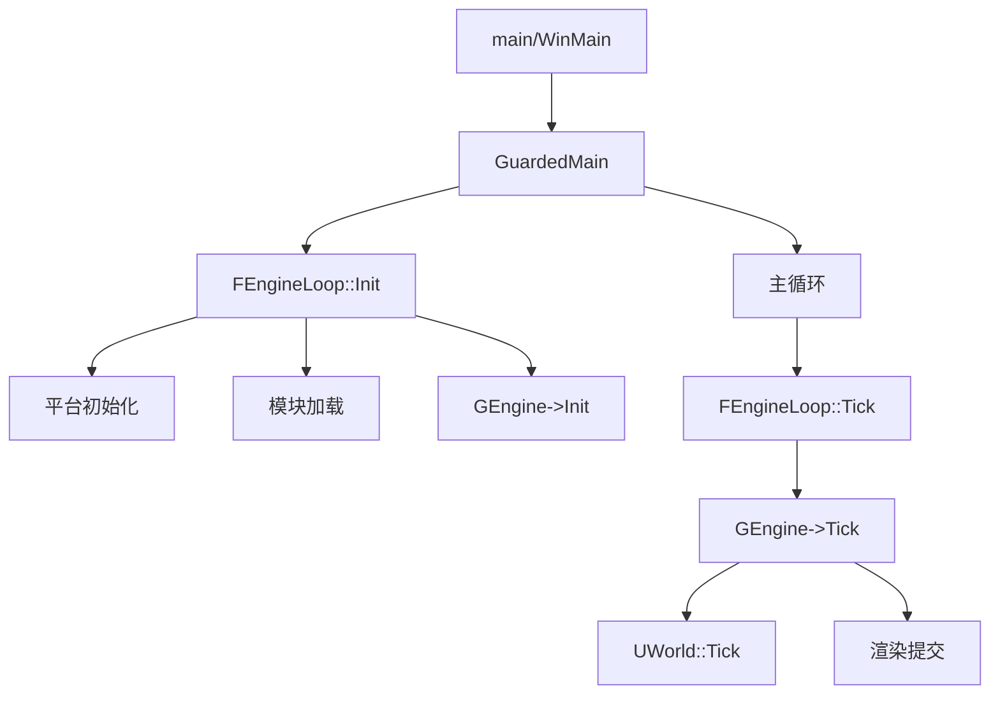

# Launch 模块详解

## 摘要

Launch 模块是 UE5.7.4 的入口点模块，包含引擎的 `main()` / `WinMain()` 函数和主循环 `FEngineLoop`。它负责引擎初始化、模块加载、主循环驱动、以及退出清理。所有引擎执行都从 Launch 开始。

---

## 1. 模块定位

Launch 是引擎的最顶层入口模块：
- **入口函数**: `main()` / `WinMain()` / `android_main()`
- **主循环**: `FEngineLoop::Init()` + `FEngineLoop::Tick()`
- **模块加载**: 初始化 FModuleManager 并加载所有预加载模块
- **平台启动**: 调用平台相关的初始化

---

## 2. 所在路径

- **Public**: `Engine/Source/Runtime/Launch/Public/`
- **Private**: `Engine/Source/Runtime/Launch/Private/`
- **Resources**: `Engine/Source/Runtime/Launch/Resources/Version.h`
- **Build.cs**: `Engine/Source/Runtime/Launch/Launch.Build.cs`

---

## 3. Build.cs 依赖关系

### 公共依赖
- `Core`

### 私有依赖
- `DerivedDataCache`
- `SessionServices`, `CookOnTheFly`, `AgilitySDK`, `Json`
- 平台特定模块（条件编译）

---

## 4. Public API 关键类

| 类/函数 | 文件 | 职责 |
|---------|------|------|
| `GuardedMain()` | `Launch.cpp` | 引擎主函数（平台无关） |
| `FEngineLoop` | `LaunchEngineLoop.h` | 引擎主循环 |
| `ENGINE_VERSION` | `Resources/Version.h` | 版本宏 |

---

## 5. 关键函数

| 函数 | 文件 | 作用 |
|------|------|------|
| `GuardedMain()` | `Launch.cpp` | 引擎入口（异常保护） |
| `FEngineLoop::Init()` | `LaunchEngineLoop.cpp` | 引擎初始化 |
| `FEngineLoop::Tick()` | `LaunchEngineLoop.cpp` | 每帧 Tick |
| `FEngineLoop::Exit()` | `LaunchEngineLoop.cpp` | 引擎退出 |
| `LoadPreInitModules()` | `LaunchEngineLoop.cpp` | 加载预初始化模块 |
| `LoadStartupModules()` | `LaunchEngineLoop.cpp` | 加载启动模块 |

---

## 6. 初始化流程

```
WinMain() / main()
  │
  └─ GuardedMain()
      │
      ├─ FEngineLoop::Init()
      │   ├─ FPlatformMisc::PlatformInit() — 平台初始化
      │   ├─ FModuleManager::Initialize() — 模块管理器
      │   ├─ LoadPreInitModules() — 预加载模块
      │   │   ├─ Core, CoreUObject
      │   │   ├─ Engine
      │   │   ├─ Renderer
      │   │   └─ ApplicationCore, Slate, etc.
      │   ├─ GEngine->Init() — 引擎初始化
      │   │   ├─ UGameInstance 初始化
      │   │   ├─ UWorld 创建
      │   │   └─ 渲染线程启动
      │   └─ LoadStartupModules() — 加载项目模块
      │
      └─ 主循环
          └─ while (!IsEngineExitRequested())
              └─ FEngineLoop::Tick()
                  ├─ FApp::GetDeltaTime()
                  ├─ GEngine->Tick()
                  │   ├─ UWorld::Tick()
                  │   └─ FRendererModule::RenderThread
                  ├─ FlushRenderingCommands()
                  └─ FTaskGraphInterface::WaitUntilTasksComplete()
```

---

## 7. 运行时调用链

### FEngineLoop::Tick()
```
FEngineLoop::Tick()
  ├─ FApp::UpdateLastFrameTime()
  ├─ GGameThreadId 确认
  ├─ FTaskGraphInterface::ProcessThreadUntilIdle()
  ├─ GEngine->Tick(deltaTime)
  │   ├─ UWorld::Tick()
  │   ├─ 渲染命令提交
  │   └─ 性能统计
  ├─ FFrameEndSync.Sync() — GT/RT 同步
  └─ FCoreDelegates::OnEndFrameTick
```

---

## 8. 与其他模块的关系

```
Launch → Core (基础依赖)
Launch → Engine (GEngine->Init/Tick)
Launch → Renderer (渲染线程管理)
Launch → 所有预加载模块 (通过 FModuleManager)
```

Launch 是依赖树的顶层，依赖几乎所有模块。

---

## 9. Mermaid 调用图



---

## 10. 源码证据

- `Engine/Source/Runtime/Launch/Private/Launch.cpp` — GuardedMain 入口
- `Engine/Source/Runtime/Launch/Private/LaunchEngineLoop.h` — FEngineLoop 定义
- `Engine/Source/Runtime/Launch/Private/LaunchEngineLoop.cpp` — Init/Tick 实现
- `Engine/Source/Runtime/Launch/Resources/Version.h` — 版本宏
- `Engine/Source/Runtime/Launch/Launch.Build.cs` — 依赖定义

---

## 11. 相关文档

- [Core 模块详解](Core.md)
- [Engine 模块详解](Engine.md)
- [03_ENGINE_BOOT/Launch_Flow.md](../03_ENGINE_BOOT/Launch_Flow.md)
- [03_ENGINE_BOOT/EngineLoop.md](../03_ENGINE_BOOT/EngineLoop.md)
