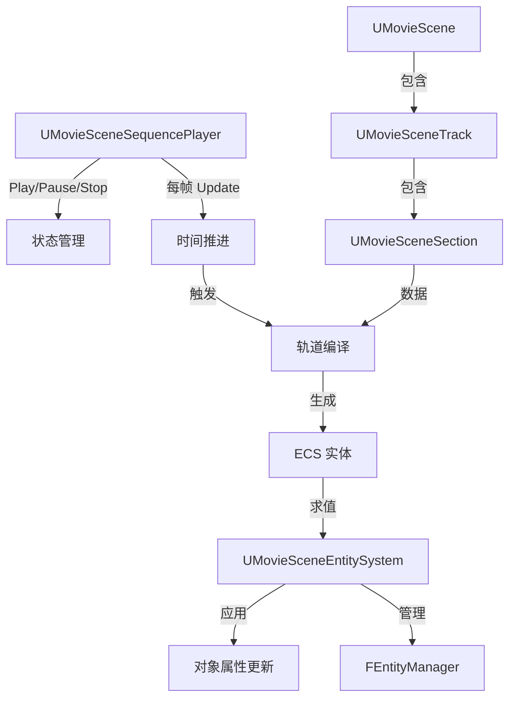

# MovieScene

## 摘要
Sequencer 电影式动画的运行时核心：基于 ECS 的轨道求值系统，管理时间轴、关键帧、绑定和序列播放。

## 1. 模块定位
MovieScene 是 Sequencer 系统的运行时引擎。它提供 `UMovieScene`（时间轴数据）、`UMovieSceneTrack`（轨道基类）、`UMovieSceneSection`（时间片段）、`UMovieSceneSequencePlayer`（播放控制）。求值基于自定义 ECS（`FEntityManager`），将轨道数据转换为实体组件进行高效批量求值。

## 2. 所在路径
```
Engine/Source/Runtime/MovieScene/
├── Public/
│   ├── MovieScene.h
│   ├── MovieSceneSequence.h
│   ├── MovieSceneSequencePlayer.h
│   ├── MovieSceneTrack.h
│   ├── MovieSceneSection.h
│   └── EntitySystem/          (自定义 ECS)
├── Private/
│   ├── MovieScene.cpp
│   ├── Evaluation/            (求值器)
│   ├── EntitySystem/          (ECS 实现)
│   ├── Channels/              (关键帧通道)
│   ├── Compilation/           (轨道编译)
│   ├── Generators/            (属性动画生成器)
│   └── Bindings/              (对象绑定)
└── MovieScene.Build.cs
```

## 3. Build.cs 依赖关系
```csharp
// MovieScene.Build.cs
PublicDependencyModuleNames = {
    "Core", "CoreUObject", "InputCore", "Engine",
    "SlateCore", "TimeManagement", "UniversalObjectLocator"
};
PrivateDependencyModuleNames = { "AutoRTFM" };
// 私有包含: AutoRTFM, MovieSceneTracks, TargetPlatform
```

## 4. Public API（7个关键类）

| 类 | 文件 | 职责 |
|----|------|------|
| `UMovieScene` | MovieScene.h | 时间轴数据容器（PlaybackRange, Sections） |
| `UMovieSceneSection` | MovieSceneSection.h | 时间片段（关键帧区域） |
| `UMovieSceneTrack` | MovieSceneTrack.h | 轨道基类（包含多个 Section） |
| `UMovieSceneSequence` | MovieSceneSequence.h | 序列资源基类（LevelSequence 父类） |
| `UMovieSceneSequencePlayer` | MovieSceneSequencePlayer.h | 播放控制（Play/Pause/Stop/Scrubby） |
| `UMovieSceneEntitySystem` | EntitySystem/ | ECS 系统基类 |
| `FEntityManager` | EntitySystem/ | 自定义 ECS 管理器 |

## 5. 关键函数（含文件路径）

### 5.1 UMovieSceneSequencePlayer::Play() / Pause() / Stop()
```cpp
// 控制 Sequencer 播放状态
virtual void Play() override;
virtual void Pause() override;
virtual void Stop() override;
```

### 5.2 UMovieScene::GetPlaybackRange()
```cpp
// 获取时间轴的有效播放范围
TRange<FFrameNumber> GetPlaybackRange() const;
```

### 5.3 UMovieSceneSequencePlayer::Update()
```cpp
// 每帧更新：推进时间 → 编译轨道 → 求值 ECS → 应用属性
void Update(DeltaTime);
```

### 5.4 FEntityManager::AddSystem()
```cpp
// 注册 ECS 系统（如属性动画、变换求值）
FMovieSceneEntitySystemLinker* AddSystem(UMovieSceneEntitySystem* System);
```

### 5.5 UMovieSceneTrack::Compile()
```cpp
// 将轨道数据编译为 ECS 实体
virtual void Compile(FMovieSceneTrackCompilerArgs& Args) const;
```

## 6. 初始化流程
```cpp
// FMovieSceneModule::StartupModule()
// 1. 初始化自定义 ECS 系统
// 2. 注册标准轨道编译器
// 3. 初始化 FEntityManager
// 4. 绑定 TimeManagement 时钟同步
```

## 7. 与其他模块的关系
```
TimeManagement (时间管理)
  └──> MovieScene (序列动画核心)
         ├──被依赖──> MovieSceneTracks (具体轨道类型)
         ├──被依赖──> LevelSequence (关卡序列)
         ├──被依赖──> UMG (UWidgetAnimation)
         └──被依赖──> Niagara (粒子动画轨道)
```

## 8. 常见扩展点
- **自定义轨道**：继承 `UMovieSceneTrack` 和 `UMovieSceneSection`
- **自定义 ECS 系统**：继承 `UMovieSceneEntitySystem`
- **属性动画**：通过 MovieSceneTracks 模块添加 Float/Vector/Transform 轨道
- **对象绑定**：通过 `UniversalObjectLocator` 绑定动态对象

## 9. Mermaid 调用图


## 10. 源码证据
- `MovieScene.Build.cs:11-19`：公共依赖含 Engine、SlateCore、TimeManagement
- `MovieScene.Build.cs:24`：私有依赖 AutoRTFM（事务性内存）
- `Private/EntitySystem/`：自定义 ECS 实现，非使用 Engine 的 ECS
- `Private/Compilation/`：轨道编译器，将数据转换为 ECS 实体
- `UniversalObjectLocator` 集成用于动态对象绑定

## 11. 相关文档
- `UE5_知识树.txt` — A.核心层 / MovieScene 模块
- Epic 官方文档: Sequencer and Movie Scene
