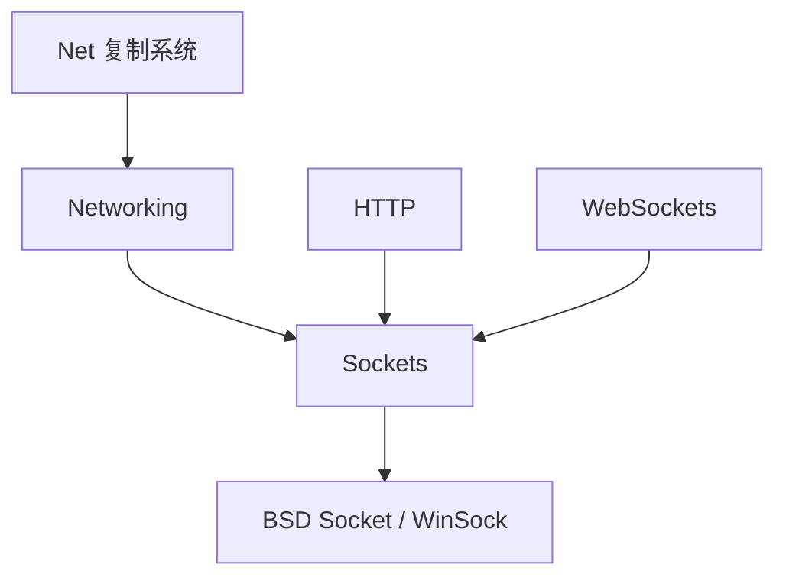

# Networking / Sockets 模块详解

## 摘要

Networking 和 Sockets 模块提供 UE5.7.4 的网络基础层。Sockets 封装平台 Socket API（BSD/WinSock），Networking 在其上提供 TCP/UDP 的高级抽象。Engine 模块中的 Net 子模块实现 UE 的网络复制系统。

---

## 1. 模块定位

- **Sockets**: 底层 Socket 抽象（FSocket, FInternetAddr, ISocketSubsystem）
- **Networking**: 高级网络工具（FTcpListener, FUdpSocketReceiver/Sender）
- **Net**: UE 网络复制系统（UNetDriver, UActorChannel, Replication）

---

## 2. 所在路径

- **Sockets**: `Engine/Source/Runtime/Sockets/`
- **Networking**: `Engine/Source/Runtime/Networking/`
- **Net**: `Engine/Source/Runtime/Net/`（含 Iris 复制系统）

---

## 3. Build.cs 依赖关系

- **Sockets**: 依赖 Core
- **Networking**: 依赖 Core, Sockets
- **Net**: 依赖 Core, CoreUObject, Engine

---

## 4. Public API 关键类

### Sockets
| 类 | 文件 | 职责 |
|----|------|------|
| `FSocket` | `Sockets.h:18` | Socket 抽象基类 |
| `FInternetAddr` | `InternetAddr.h` | 网络地址抽象 |
| `ISocketSubsystem` | `SocketSubsystem.h` | Socket 子系统管理 |

### Networking
| 类 | 文件 | 职责 |
|----|------|------|
| `FTcpListener` | `TcpListener.h:27` | TCP 监听器 |
| `FUdpSocketReceiver` | `UdpSocketReceiver.h` | UDP 接收器 |
| `FUdpSocketSender` | `UdpSocketSender.h` | UDP 发送器 |

---

## 5. 关键函数

| 函数 | 文件 | 作用 |
|------|------|------|
| `FSocket::Connect()` | `Sockets.h:117` | 连接远程 |
| `FSocket::Send()` | `Sockets.h:190` | 发送数据 |
| `FSocket::Recv()` | `Sockets.h:221` | 接收数据 |
| `FTcpListener::OnConnectionAccepted()` | `TcpListener.h:129` | 连接接受委托 |

---

## 6. 初始化流程

```
ISocketSubsystem::Get()
  └─ 平台特定的 SocketSubsystem
      ├─ FSocketSubsystemBSD (Unix/Android)
      └─ FSocketSubsystemWindows (Windows)
```

---

## 7. 与其他模块的关系

- **Sockets** ← Networking, HTTP, WebSockets
- **Networking** ← Net (网络复制)
- **Net** ← Engine (Actor 复制)

---

## 8. Mermaid 调用图



---

## 9. 源码证据

- `Engine/Source/Runtime/Sockets/Public/Sockets.h:18` — FSocket
- `Engine/Source/Runtime/Networking/Public/TcpListener.h:27` — FTcpListener
- `Engine/Source/Runtime/Net/` — Iris 复制系统

---

## 10. 相关文档

- [HTTP 模块详解](HTTP.md)
- [WebSockets 模块详解](WebSockets.md)
- [10_NETWORKING/Replication.md](../10_NETWORKING/Replication.md)
