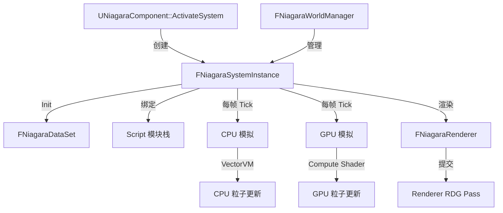

# Niagara

## 摘要
引擎下一代粒子/VFX 系统：基于节点图的 GPU/CPU 模拟框架，支持数据接口扩展、事件驱动和 Sequencer 集成。

## 1. 模块定位
Niagara 是 UE5 的主要 VFX 系统，取代旧版 Cascade。它基于数据导向设计：`FNiagaraDataSet`（SOA 数据集）存储粒子属性，通过 HLSL/VectorVM 脚本在 GPU 或 CPU 上执行模拟。系统由 `UNiagaraSystem`（资源）、`UNiagaraEmitter`（发射器）、`FNiagaraSystemInstance`（运行时实例）组成。

## 2. 所在路径
```
Engine/Plugins/FX/Niagara/Source/Niagara/
├── Public/
│   ├── NiagaraSystem.h
│   ├── NiagaraEmitter.h
│   ├── NiagaraComponent.h
│   └── NiagaraDataSet.h
├── Private/
│   ├── NiagaraSystemInstance.cpp/h
│   ├── NiagaraWorldManager.cpp/h
│   ├── DataInterface/         (GPU 数据接口)
│   ├── MovieScene/            (Sequencer 集成)
│   └── Experimental/
└── Niagara.Build.cs
```

## 3. Build.cs 依赖关系
```csharp
// Niagara.Build.cs
PublicDependencyModuleNames = {
    "CoreUObject", "MovieScene", "MovieSceneTracks",
    "NiagaraCore", "NiagaraShader", "NiagaraVertexFactories",
    "PhysicsCore", "RenderCore", "RHI", "VectorVM",
    "SlateCore", "GameplayTags"
};
PrivateDependencyModuleNames = {
    "ApplicationCore", "Engine", "Json",
    "Renderer", "TimeManagement", "TraceLog", ...
};
// Editor: 额外依赖 UnrealEd, Slate, TargetPlatform
```

## 4. Public API（6个关键类）

| 类 | 文件 | 职责 |
|----|------|------|
| `UNiagaraSystem` | NiagaraSystem.h | 顶级 VFX 资源，包含多个 Emitter |
| `UNiagaraEmitter` | NiagaraEmitter.h | 单个发射器定义（模块栈、脚本） |
| `UNiagaraComponent` | NiagaraComponent.h | Actor 组件，管理 System 实例 |
| `FNiagaraSystemInstance` | NiagaraSystemInstance.h | 运行时模拟实例 |
| `FNiagaraDataSet` | NiagaraDataSet.h | 粒子数据集（SOA 布局） |
| `FNiagaraWorldManager` | NiagaraWorldManager.h | 世界级 Niagara 管理器 |

## 5. 关键函数（含文件路径）

### 5.1 UNiagaraComponent::ActivateSystem()
```cpp
// 创建 FNiagaraSystemInstance 并开始模拟
virtual void ActivateSystem(bool bReset = false) override;
```

### 5.2 FNiagaraSystemInstance::Tick()
```cpp
// 每帧执行所有 Emitter 的模拟脚本
void Tick(float DeltaSeconds);
```

### 5.3 FNiagaraSystemInstance::Init()
```cpp
// 初始化数据集、绑定参数、编译脚本
bool Init(UNiagaraSystem* InSystem, ...);
```

### 5.4 FNiagaraWorldManager::Update()
```cpp
// 更新所有活跃的 Niagara System 实例
void Update(FRHICommandListImmediate& RHICmdList, ...);
```

### 5.5 FNiagaraDataSet::Allocate()
```cpp
// 分配/重分配粒子数据缓冲区
void Allocate(int32 NumInstances);
```

## 6. 初始化流程
```cpp
// INiagaraModule::StartupModule()
// + OnPostEngineInit() 回调:
// 1. 注册 Niagara Shader 类型
// 2. 初始化 VectorVM
// 3. 注册数据接口（ NiagaraDataInterfaceArray, etc.）
// 4. 绑定 FNiagaraWorldManager 到 UWorld
```

## 7. 与其他模块的关系
```
RenderCore (Shader, RDG)
  └──> NiagaraShader (Niagara Shader 编译)
         └──> Niagara (VFX 系统)
                ├──> VectorVM (脚本执行引擎)
                ├──> Renderer (GPU 粒子渲染)
                ├──> MovieScene (Sequencer 动画)
                └──> PhysicsCore (碰撞交互)
```

## 8. 常见扩展点
- **自定义数据接口**：继承 `UNiagaraDataInterface` 暴露外部数据
- **自定义模块脚本**：用 HLSL 或 Visual Scripting 编写模拟模块
- **自定义 Renderer**：继承 `FNiagaraRenderer` 实现自定义粒子渲染
- **Simulation Stage**：多阶段模拟管线（GPU 并行）

## 9. Mermaid 调用图


## 10. 源码证据
- `Niagara.Build.cs:23-39`：公共依赖含 NiagaraCore、NiagaraShader、VectorVM、RenderCore
- `Niagara.Build.cs:10-25`：私有依赖含 ApplicationCore、Engine、Renderer
- `Private/NiagaraSystemInstance.cpp`：核心模拟循环
- `Private/DataInterface/`：丰富的 GPU 数据接口实现
- VectorVM 集成用于 CPU 端脚本执行

## 11. 相关文档
- `UE5_知识树.txt` — C.插件系统 / Niagara
- Epic 官方文档: Niagara VFX System
