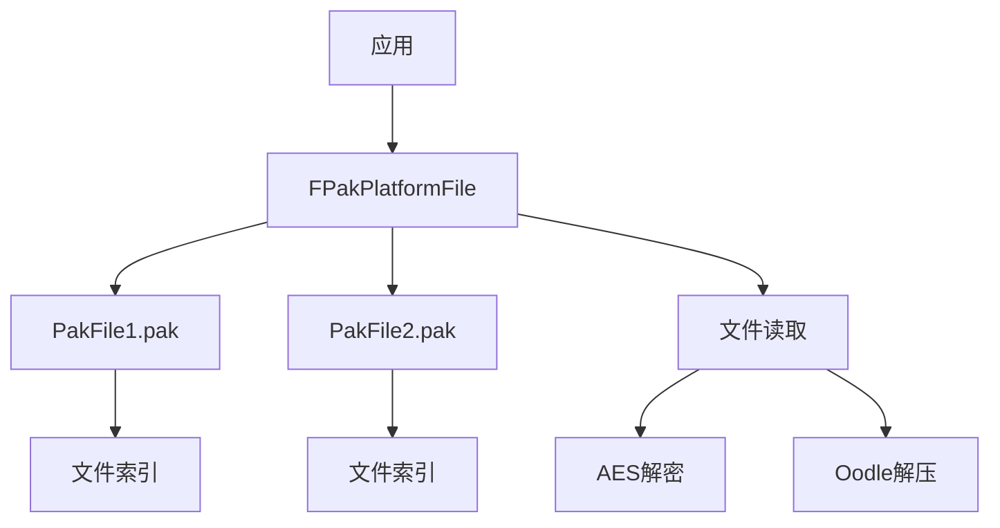

# PakFile 模块详解

## 摘要

PakFile 模块实现了 UE5.7.4 的 Pak 文件格式，用于打包和分发游戏资源。Pak 文件是只读归档格式，包含加密、压缩和签名验证。通过 `FPakPlatformFile` 集成到 UE 的虚拟文件系统（IPlatformFile 链），支持运行时挂载和卸载。

---

## 1. 模块定位

PakFile 提供：
- Pak 文件格式解析和挂载
- 文件索引和查找
- 加密（AES）和压缩（Oodle, Zlib）
- 签名验证（RSA）
- 与 IPlatformFile 无缝集成

---

## 2. 所在路径

- **Public**: `Engine/Source/Runtime/PakFile/Public/`
- **Private**: `Engine/Source/Runtime/PakFile/Private/`
- **Build.cs**: `Engine/Source/Runtime/PakFile/PakFile.Build.cs`

---

## 3. Build.cs 依赖关系

### 公共依赖
- `RSA`（签名验证）

### 私有依赖
- `Core`, `CoreUObject`, `TraceLog`

---

## 4. Public API 关键类

| 类 | 文件 | 职责 |
|----|------|------|
| `FPakFile` | `PakFile.h` | Pak 文件主类，管理索引和查找 |
| `FPakPlatformFile` | `IPlatformFilePak.h` | IPlatformFile 实现，Pak 挂载管理 |
| `FPakInfo` | `PakFile.h` | Pak 文件头信息（版本、索引偏移） |
| `FPakEntry` | `IPlatformFilePak.h` | 单个文件条目（偏移、大小、压缩） |
| `FPakEntryLocation` | `IPlatformFilePak.h` | 条目位置标识符 |
| `FPakSignatureFile` | `IPlatformFilePak.h` | 签名文件结构 |

---

## 5. 关键函数

| 函数 | 文件 | 作用 |
|------|------|------|
| `FPakPlatformFile::Mount()` | `IPlatformFilePak.h:2217` | 挂载 Pak 文件 |
| `FPakFile::Find()` | `PakFile.h:1059` | 在 Pak 中查找文件 |
| `FPakFile::LoadIndex()` | `PakFile.h:1490` | 加载 Pak 索引 |
| `FPakPlatformFile::Initialize()` | `IPlatformFilePak.h:2186` | 初始化 Pak 文件系统 |
| `FPakEntry::Serialize()` | `IPlatformFilePak.h:511` | 序列化条目信息 |

---

## 6. 初始化流程

```
FPlatformFileManager::Get()
  │
  └─ FPakPlatformFile 被插入到 IPlatformFile 链
      ├─ Initialize(InnerPlatformFile)
      ├─ 通过 FCoreDelegates::MountPak 挂载
      └─ 支持多层 Pak 挂载
```

---

## 7. 运行时调用链

### Pak 挂载
```
FPakPlatformFile::Mount(PakPath, MountPoint)
  ├─ 创建 FPakFile
  │   ├─ 读取 FPakInfo（文件头）
  │   └─ LoadIndex()（加载文件索引）
  ├─ 验证签名（如果启用）
  ├─ 注册到 MountPoint 映射
  └─ 文件请求自动路由到 Pak
```

### 文件读取
```
IPlatformFile::OpenRead(Filename)
  └─ FPakPlatformFile::OpenRead()
      ├─ FindInPakFiles(Filename)
      ├─ FPakFile::Find() → FPakEntry
      └─ FPakFileHandle 创建
          └─ Read() → 解压 → 返回数据
```

---

## 8. 与其他模块的关系

- **依赖**: Core, CoreUObject, RSA
- **被依赖**: Engine（资源加载）、所有使用 Pak 的模块
- **集成**: IPlatformFile 接口链

---

## 9. 常见扩展点

1. **自定义加密**: 修改 AES 加密密钥处理
2. **自定义压缩**: 添加新的压缩算法支持
3. **挂载顺序**: 控制多个 Pak 的挂载优先级

---

## 10. Mermaid 调用图



---

## 11. 源码证据

- `Engine/Source/Runtime/PakFile/Public/PakFile.h:1059` — FPakFile::Find
- `Engine/Source/Runtime/PakFile/Public/IPlatformFilePak.h:2217` — FPakPlatformFile::Mount
- `Engine/Source/Runtime/PakFile/PakFile.Build.cs` — 依赖定义

---

## 12. 相关文档

- [07_ASSET_PIPELINE/Pak.md](../07_ASSET_PIPELINE/Pak.md)
- [07_ASSET_PIPELINE/IOStore.md](../07_ASSET_PIPELINE/IOStore.md)
