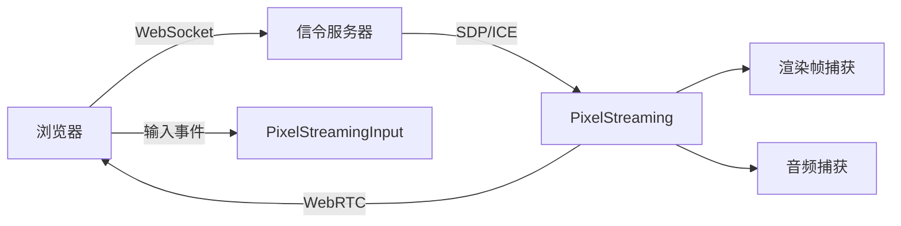

# PixelStreaming 模块详解

## 摘要

PixelStreaming 是 UE5.7.4 的远程渲染和流送插件，使用 WebRTC 将引擎渲染画面实时编码并通过网络发送到浏览器/移动端。支持远程输入、音频双向传输、数据通道通信。信令通过 WebSocket 连接到信令服务器。

---

## 1. 模块定位

PixelStreaming 提供：
- 基于 WebRTC 的实时视频流送
- 远程输入（鼠标、键盘、触摸）
- 双向音频
- 数据通道（自定义消息）
- 多路流（Multiple Streamers）

---

## 2. 所在路径

- **主模块**: `Engine/Plugins/Media/PixelStreaming/Source/PixelStreaming/`
- **Input**: `Engine/Plugins/Media/PixelStreaming/Source/PixelStreamingInput/`
- **Capture**: `Engine/Plugins/Media/PixelStreaming/Source/PixelCapture/`

---

## 3. Build.cs 依赖关系

### 公共依赖
- `ApplicationCore`, `InputDevice`, `WebRTC`, `PixelCapture`, `MediaIOCore`

### 私有依赖
- `Core`, `CoreUObject`, `Engine`, `WebSockets`, `Sockets`, `HTTP`, `JSON`
- `Slate`, `AudioMixer`, `Renderer`, `RHI`

---

## 4. Public API 关键类

| 类 | 文件 | 职责 |
|----|------|------|
| `IPixelStreamingModule` | `IPixelStreamingModule.h` | 模块接口 |
| `IPixelStreamingStreamer` | `IPixelStreamingStreamer.h` | 流送器接口 |
| `FPixelStreamingPeerConnection` | `PixelStreamingPeerConnection.h` | WebRTC 对等连接 |
| `FPixelStreamingDataChannel` | 数据通道 | 自定义消息收发 |
| `IPixelStreamingSignallingConnection` | 信令连接接口 | WebSocket 信令 |

---

## 5. 关键函数

| 函数 | 文件 | 作用 |
|------|------|------|
| `IPixelStreamingModule::CreateStreamer()` | `IPixelStreamingModule.h:89` | 创建流送器 |
| `IPixelStreamingStreamer::StartStreaming()` | `IPixelStreamingStreamer.h:121` | 开始流送 |
| `IPixelStreamingStreamer::SetSignallingServerURL()` | `IPixelStreamingStreamer.h:99` | 设置信令服务器 |
| `IPixelStreamingStreamer::SendPlayerMessage()` | `IPixelStreamingStreamer.h:195` | 发送自定义消息 |

---

## 6. 架构

```
浏览器 ←──WebRTC──→ PixelStreaming Plugin
  │                     │
  ├─ 信令 ──WebSocket──→ 信令服务器
  ├─ 视频 ←─H.264/VP8──┤
  ├─ 音频 ←───────Opus──┤
  ├─ 输入 ──DataChannel─→ InputDevice
  └─ 自定义 ─DataChannel→ DataChannel
```

---

## 7. 与其他模块的关系

- **依赖**: WebRTC, WebSockets, HTTP, Sockets, AudioMixer, RHI, Renderer
- **被依赖**: 游戏项目（通过插件引用）

---

## 8. Mermaid 调用图



---

## 9. 源码证据

- `Engine/Plugins/Media/PixelStreaming/Source/PixelStreaming/Public/IPixelStreamingModule.h:22` — 模块接口
- `Engine/Plugins/Media/PixelStreaming/Source/PixelStreaming/Public/IPixelStreamingStreamer.h:20` — 流送器接口
- `Engine/Plugins/Media/PixelStreaming/Source/PixelStreaming/PixelStreaming.Build.cs` — 依赖定义

---

## 10. 相关文档

- [WebSockets 模块详解](WebSockets.md)
- [HTTP 模块详解](HTTP.md)
