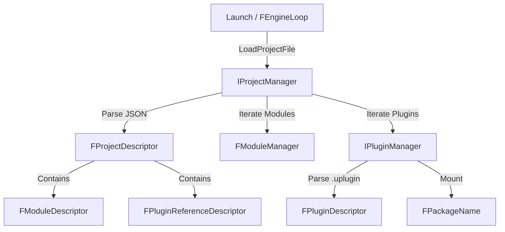

# Projects

## 摘要
管理 .uproject 项目描述文件的加载/保存/签名，以及引擎插件的发现、启用/禁用生命周期控制。

## 1. 模块定位
Projects 是引擎运行时最早期加载的模块之一，负责在引擎启动阶段解析当前项目的 `.uproject` 文件，读取模块列表与插件引用，驱动 `FModuleManager` 按阶段加载代码模块。它与 `FPluginManager` 紧密配合，管理所有引擎/项目/外部插件的发现与加载决策。

## 2. 所在路径
```
Engine/Source/Runtime/Projects/
├── Public/
│   ├── Interfaces/
│   │   ├── IProjectManager.h
│   │   └── IPluginManager.h
│   ├── ProjectDescriptor.h
│   ├── PluginDescriptor.h
│   ├── ModuleDescriptor.h
│   ├── PluginReferenceDescriptor.h
│   ├── LocalizationDescriptor.h
│   └── Projects.h (统一包含入口)
├── Private/
│   ├── ProjectManager.cpp/h
│   ├── PluginManager.cpp/h
│   ├── ProjectsModule.cpp
│   └── RapidJsonPluginLoading.cpp/h
└── Projects.Build.cs
```

## 3. Build.cs 依赖关系
```csharp
// Projects.Build.cs
PublicDependencyModuleNames = { "Core", "Json" };
// Editor Shared build 时额外依赖 DesktopPlatform（读取 TargetReceipt）
PrivateDependencyModuleNames = { "DesktopPlatform" }; // 仅特定配置
```
核心依赖仅 Core + Json，保持极简以在启动最早期可用。

## 4. Public API（6个关键类）

| 类/结构体 | 文件 | 职责 |
|-----------|------|------|
| `IProjectManager` | Public/Interfaces/IProjectManager.h | 项目管理器抽象接口，单例 `Get()` |
| `FProjectManager` | Private/ProjectManager.h | IProjectManager 的唯一实现类 |
| `FProjectDescriptor` | Public/ProjectDescriptor.h | .uproject 文件的完整数据模型 |
| `IPluginManager` | Public/Interfaces/IPluginManager.h | 插件发现/查询/启禁用的抽象接口 |
| `FPluginDescriptor` | Public/PluginDescriptor.h | .uplugin 文件的完整数据模型 |
| `FModuleDescriptor` | Public/ModuleDescriptor.h | 模块加载阶段、类型等描述信息 |

## 5. 关键函数（含文件路径）

### 5.1 IProjectManager::LoadProjectFile()
```cpp
// Public/Interfaces/IProjectManager.h:99
virtual bool LoadProjectFile(const FString& ProjectFile) = 0;
```
加载指定 .uproject 文件，解析 JSON 并填充 `CurrentProject`。返回 false 时引擎无法启动。

### 5.2 IProjectManager::LoadModulesForProject()
```cpp
// Public/Interfaces/IProjectManager.h:107
virtual bool LoadModulesForProject(const ELoadingPhase::Type LoadingPhase) = 0;
```
按加载阶段（Default, PreDefault, PostEngineInit 等）驱动模块加载。被 `FEngineLoop` 调用。

### 5.3 IProjectManager::SetPluginEnabled()
```cpp
// Public/Interfaces/IProjectManager.h:218
virtual bool SetPluginEnabled(const FString& PluginName, bool bEnabled, FText& OutFailReason) = 0;
```
运行时动态启用/禁用插件，修改 CurrentProject 描述符，但需重启才能生效。

### 5.4 IProjectManager::QueryStatusForProject()
```cpp
// Public/Interfaces/IProjectManager.h:163
virtual bool QueryStatusForProject(const FString& FilePath, FProjectStatus& OutProjectStatus) const = 0;
```
查询指定项目的状态信息（名称、分类、目标平台等），用于项目浏览器。

### 5.5 FProjectDescriptor::Load()
```cpp
// Public/ProjectDescriptor.h:124
bool Load(const FString& FileName, FText& OutFailReason);
```
从磁盘文件加载并反序列化项目描述符。

## 6. 初始化流程
```cpp
// Private/ProjectsModule.cpp:14-27
class FProjectsModule : public IModuleInterface
{
    virtual void StartupModule() override { }   // 空实现
    virtual void ShutdownModule() override { }
};
IMPLEMENT_MODULE(FProjectsModule, Projects);
```
模块本身为空壳。`IProjectManager::Get()` 返回的 `FProjectManager` 单例由引擎初始化时显式创建，不依赖模块 Startup。

## 7. 与其他模块的关系
```
Launch ──调用──> Projects::LoadProjectFile()
                    │
                    ├──读取──> FProjectDescriptor (JSON)
                    │
                    ├──调用──> FModuleManager (按阶段加载模块)
                    │
                    └──查询──> IPluginManager (发现/加载插件)
                                  │
                                  └──读取──> FPluginDescriptor (.uplugin JSON)
```
- **Launch**：引擎入口，调用 `LoadProjectFile()` 和 `LoadModulesForProject()`
- **Json**：反序列化 .uproject / .uplugin 文件
- **DesktopPlatform**：Editor 模式下读取 Target Receipt

## 8. 常见扩展点
- **自定义模块加载阶段**：在 .uproject 的 Modules 数组中配置 `LoadingPhase`
- **插件引用**：通过 `FPluginReferenceDescriptor` 声明项目级插件依赖
- **额外插件目录**：`FProjectDescriptor::AddPluginDirectory()` 添加外部插件搜索路径
- **自定义构建步骤**：`FCustomBuildSteps` 配置 PreBuild/PostBuild 脚本

## 9. Mermaid 调用图


## 10. 源码证据
- `Projects.Build.cs`：仅依赖 Core + Json，确认模块极简定位
- `FProjectsModule`（ProjectsModule.cpp:14）：空实现，逻辑由 `FProjectManager` 单例承载
- `FProjectDescriptor`（ProjectDescriptor.h:42-208）：包含 Modules、Plugins、TargetPlatforms 等字段
- `IProjectManager`（Interfaces/IProjectManager.h:70-277）：纯虚接口，定义 20+ 方法
- `FProjectManager`（Private/ProjectManager.h:13）：final 实现，持有 `CurrentProject` 智能指针

## 11. 相关文档
- `UE5_知识树.txt` — A.核心层 / Projects 模块
- Epic 官方文档: Project Descriptor File Reference
