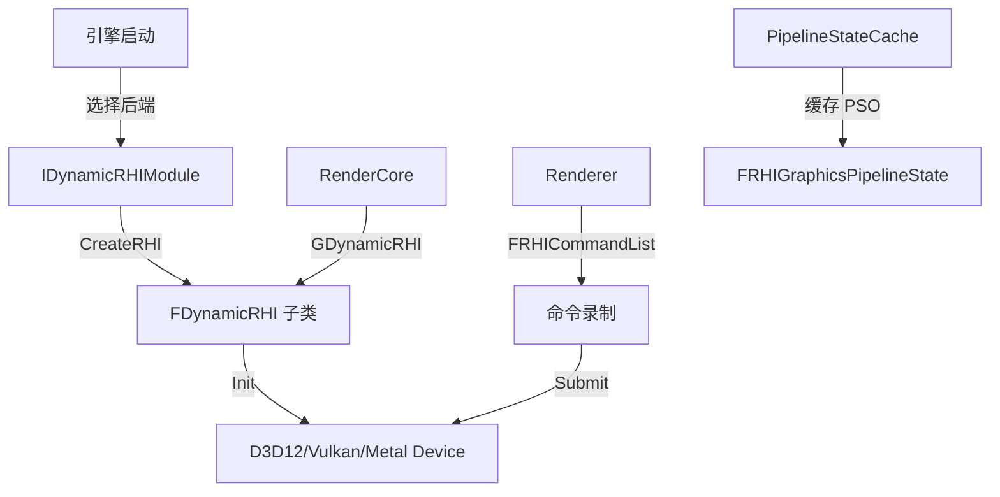

# RHI

## 摘要
渲染硬件接口抽象层：定义 GPU 资源（纹理/缓冲区/管线状态）和命令列表的跨平台 API，运行时动态加载 D3D12/Vulkan/Metal/OpenGL 后端。

## 1. 模块定位
RHI (Render Hardware Interface) 是引擎 GPU 抽象的最底层。它定义了 `FDynamicRHI`（动态 RHI 单例）、`FRHICommandList`（GPU 命令录制）、`FRHITexture`/`FRHIBuffer`（GPU 资源）、`FRHIGraphicsPipelineState`（管线状态）。平台特定实现（D3D12RHI、VulkanRHI 等）作为动态加载模块在运行时挂载。

## 2. 所在路径
```
Engine/Source/Runtime/RHI/
├── Public/
│   ├── DynamicRHI.h            (~1400 行纯虚接口)
│   ├── RHI.h                   (RHI 基础类型)
│   ├── RHICommandList.h        (命令列表)
│   ├── RHIBuffer.h             (缓冲区)
│   ├── RHITexture.h            (纹理)
│   ├── RHIResources.h          (所有 RHI 资源基类)
│   ├── PipelineStateCache.h    (PSO 缓存)
│   ├── GPUProfiler.h           (GPU 性能分析)
│   └── Android/ IOS/ ...       (平台特定扩展)
├── Private/
└── RHI.Build.cs
```

## 3. Build.cs 依赖关系
```csharp
// RHI.Build.cs
PrivateDependencyModuleNames = {
    "Core", "TraceLog", "ApplicationCore",
    "Cbor", "BuildSettings"
};
// 动态加载的后端模块:
//   NullDrv, D3D11RHI, D3D12RHI, VulkanRHI, OpenGLDrv
// （根据平台和配置决定）
```

## 4. Public API（6个关键类）

| 类 | 文件 | 职责 |
|----|------|------|
| `FDynamicRHI` | DynamicRHI.h | 动态 RHI 单例接口，~1400 个纯虚方法 |
| `FRHICommandList` | RHICommandList.h | GPU 命令录制器（立即/延迟模式） |
| `FRHIBuffer` | RHIResources.h | GPU 缓冲区基类（VB/IB/SSB/UAV） |
| `FRHITexture` | RHIResources.h | GPU 纹理基类（1D/2D/3D/Array） |
| `FRHIUniformBuffer` | RHIResources.h | 统一缓冲区（常量缓冲区） |
| `FRHIGraphicsPipelineState` | RHIResources.h | 图形管线状态（着色器+混合+光栅化） |

## 5. 关键函数（含文件路径）

### 5.1 RHICreateTexture()
```cpp
// Public/DynamicRHI.h
virtual FTextureRHIRef RHICreateTexture(const FRHITextureCreateDesc& Desc) = 0;
```

### 5.2 RHICreateBuffer()
```cpp
virtual FBufferRHIRef RHICreateBuffer(const FRHIBufferDesc& Desc, ...) = 0;
```

### 5.3 RHICreateGraphicsPipelineState()
```cpp
virtual FGraphicsPipelineStateRHIRef RHICreateGraphicsPipelineState(const FGraphicsPipelineStateInitializer& Initializer) = 0;
```

### 5.4 RHILockBuffer() / RHIUnlockBuffer()
```cpp
virtual void* RHILockBuffer(FRHICommandListImmediate& RHICmdList, FRHIBuffer* Buffer, ...) = 0;
virtual void RHIUnlockBuffer(FRHICommandListImmediate& RHICmdList, FRHIBuffer* Buffer) = 0;
```

### 5.5 RHISubmitCommandsAndFlushGPU()
```cpp
virtual void RHISubmitCommandsAndFlushGPU() = 0;
```

## 6. 初始化流程
```
1. IDynamicRHIModule (动态加载模块接口)
   └──> CreateRHI() 工厂方法
         └──> 返回 FDynamicRHI 子类实例
               └──> 赋值给 GDynamicRHI 全局单例

// Windows 典型流程:
// RHI.Build.cs 动态加载 D3D12RHI 模块
// D3D12RHI 模块导出 IDynamicRHIModule
// CreateRHI() → new FD3D12DynamicRHI()
// FD3D12DynamicRHI::Init() → 创建 D3D12 Device/Queue/CommandAllocator
```

## 7. 与其他模块的关系
```
ApplicationCore (窗口)
  └──> RHI (GPU 抽象)
         ├──> D3D12RHI (Windows Xbox)
         ├──> VulkanRHI (Windows Linux Android)
         ├──> OpenGLDrv (降级后端)
         └──> NullDrv (无头渲染)
```

## 8. 常见扩展点
- **新 GPU 后端**：实现 `IDynamicRHIModule` 和 `FDynamicRHI` 子类
- **自定义管线状态**：通过 `FRHIGraphicsPipelineStateInitializer` 配置
- **GPU 资源追踪**：`RHI_WANT_RESOURCE_INFO` 宏启用资源泄漏检测
- **多 GPU**：`MultiGPU.h` 支持 GPU 间资源迁移

## 9. Mermaid 调用图


## 10. 源码证据
- `RHI.Build.cs:11-14`：私有依赖 Core、ApplicationCore、Cbor、BuildSettings
- `RHI.Build.cs:21-53`：根据平台动态加载 D3D12RHI、VulkanRHI、OpenGLDrv
- `Public/DynamicRHI.h`：约 1400 行纯虚接口，定义所有 GPU 操作
- `RHI.Build.cs:17`：`WITH_MGPU` 仅 Windows Desktop 启用多 GPU 支持

## 11. 相关文档
- `UE5_知识树.txt` — B.渲染层 / RHI 模块
- Epic 官方文档: Render Hardware Interface
