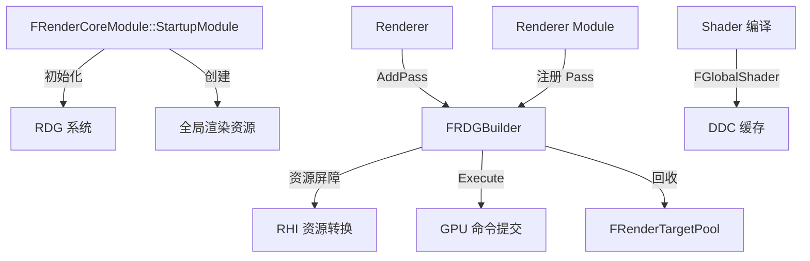

# RenderCore

## 摘要
渲染基础设施层：提供 Render Graph (RDG) 系统、全局 Shader 管理、GPU 资源池、渲染资源基类和跨平台渲染工具。

## 1. 模块定位
RenderCore 位于 RHI（GPU 抽象）和 Renderer（高级渲染管线）之间。它定义了 `FRenderResource`（渲染资源生命周期基类）、`FRDGBuilder`（Render Graph 延迟执行系统）、`FRenderTargetPool`（渲染目标复用池）、`FGlobalShader`（全局 Shader 基类）。所有渲染模块都依赖 RenderCore。

## 2. 所在路径
```
Engine/Source/Runtime/RenderCore/
├── Public/
│   ├── RenderGraph.h            (FRDGBuilder, FRDGTexture, FRDGBuffer)
│   ├── RenderResource.h         (FRenderResource 基类)
│   ├── GlobalShader.h           (FGlobalShader, FShader)
│   ├── RenderTargetPool.h       (FRenderTargetPool)
│   ├── SceneUniformBuffer.h     (FSceneUniformBuffer)
│   └── PixelShaderUtils.h      (PS/VS 工具)
├── Private/
│   ├── RenderGraph.cpp          (RDG 实现)
│   ├── GlobalShader.cpp
│   ├── GlobalRenderResources.cpp
│   ├── DynamicBufferAllocator.cpp
│   └── DumpGPU.cpp              (r.DumpGPU 命令)
└── RenderCore.Build.cs
```

## 3. Build.cs 依赖关系
```csharp
// RenderCore.Build.cs
PublicDependencyModuleNames = { "RHI", "CoreUObject" };
PrivateDependencyModuleNames = {
    "Core", "Projects", "ApplicationCore",
    "Json", "BuildSettings", "TraceLog", "CookOnTheFly"
};
// Editor: 额外依赖 DerivedDataCache, TargetPlatform
// Desktop Dev: 额外依赖 ImageWrapper (Shader 运行时可视化)
```

## 4. Public API（8个关键类）

| 类 | 文件 | 职责 |
|----|------|------|
| `FRenderResource` | RenderResource.h | 渲染资源基类（InitRHI/ReleaseRHI 生命周期） |
| `FRDGBuilder` | RenderGraph.h | Render Graph 构建器，管理 Pass 注册与执行 |
| `FRDGTexture` | RenderGraph.h | RDG 纹理（延迟分配，自动回收） |
| `FRDGBuffer` | RenderGraph.h | RDG 缓冲区（SRV/UAV 自动管理） |
| `FRenderTargetPool` | RenderTargetPool.h | 渲染目标复用池，减少分配开销 |
| `FGlobalShader` | GlobalShader.h | 全局 Shader 基类（不关联材质） |
| `FShader` | Shader.h | Shader 基类（编译/绑定管理） |
| `FSceneUniformBuffer` | SceneUniformBuffer.h | 场景级统一缓冲区 |

## 5. 关键函数（含文件路径）

### 5.1 FRenderResource::InitRHI() / ReleaseRHI()
```cpp
// Public/RenderResource.h
virtual void InitRHI(FRHICommandListBase& RHICmdList) = 0;
virtual void ReleaseRHI() = 0;
```
纯虚函数，子类实现 GPU 资源的创建和销毁。

### 5.2 FRDGBuilder::AddPass()
```cpp
// Public/RenderGraph.h
template<typename PassParametersType, typename LambdaType>
FRDGPassRef AddPass(FRDGEventName&& Name, PassParametersType* Parameters, LambdaType&& Lambda);
```
向 Render Graph 添加一个渲染 Pass，Lambda 延迟执行。

### 5.3 FRDGBuilder::Execute()
```cpp
// Public/RenderGraph.h
void Execute(FRHICommandListImmediate& RHICmdList);
```
执行所有已注册的 RDG Pass，自动管理资源屏障和回收。

### 5.4 FRenderTargetPool::FindFreeElement()
```cpp
// 在池中查找可复用的渲染目标，减少 GPU 分配
FRenderTarget* FindFreeElement(FRHICommandListImmediate& RHICmdList,
    const FPooledRenderTargetDesc& Desc, TRefCountPtr<IPooledRenderTarget>& Out);
```

### 5.5 FGlobalShader::Serialize()
```cpp
// Shader 序列化/反序列化，支持 DDC 缓存
virtual bool Serialize(FArchive& Ar) override;
```

## 6. 初始化流程
```cpp
// FRenderCoreModule::StartupModule()
// 1. InitRenderGraph() — 初始化 RDG 内存分配器
// 2. InitPixelRenderCounters() — GPU 像素计数器
// 3. 创建全局渲染资源（白纹理、黑色/白色材质等）
```

## 7. 与其他模块的关系
```
RHI (GPU 抽象)
  └──> RenderCore (RDG, Shader, 资源池)
         ├──被依赖──> Renderer (渲染管线)
         ├──被依赖──> Niagara (GPU 粒子)
         ├──被依赖──> SlateRHIRenderer (UI 渲染)
         └──被依赖──> D3D12RHI/VulkanRHI (Shader 编译)
```

## 8. 常见扩展点
- **自定义 RDG Pass**：通过 `FRDGBuilder::AddPass()` 注册
- **自定义 Shader**：继承 `FGlobalShader`，使用 `SHADER_TYPE_REGISTER` 注册
- **渲染目标复用**：通过 `FRenderTargetPool` 池化管理
- **GPU 调试**：`r.DumpGPU` 导出帧分析数据（DumpGPU.cpp）

## 9. Mermaid 调用图


## 10. 源码证据
- `RenderCore.Build.cs:12`：公共依赖 RHI + CoreUObject
- `RenderCore.Build.cs:39`：私有依赖含 Core、Projects、ApplicationCore
- `Public/RenderGraph.h`：RDG 系统，约 3000+ 行模板代码
- `Public/GlobalShader.h`：全局 Shader 基类与自动注册宏
- `Private/DumpGPU.cpp`：r.DumpGPU 命令实现

## 11. 相关文档
- `UE5_知识树.txt` — A.核心层 / RenderCore 模块
- Epic 官方文档: Render Dependency Graph
