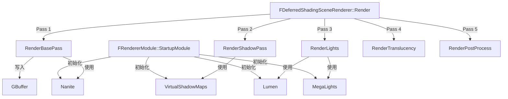

# Renderer

## 摘要
引擎核心渲染管线实现：延迟着色渲染器、光照计算、阴影系统，以及 Lumen/Nanite/VirtualShadowMaps/MegaLights 等UE5 子系统。

## 1. 模块定位
Renderer 是引擎渲染管线的核心实现模块。它包含 `FDeferredShadingSceneRenderer`（主渲染器）、`FScene`（场景渲染数据）、`FPrimitiveSceneInfo`（图元渲染代理）。渲染流程按 Pass 组织（BasePass、ShadowPass、LightPass、TranslucencyPass、PostProcess），通过 Render Graph (RDG) 管理资源。

## 2. 所在路径
```
Engine/Source/Runtime/Renderer/
├── Private/
│   ├── DeferredShadingRenderer.cpp/h  (主渲染器)
│   ├── BasePassRendering.cpp/h        (基础通道)
│   ├── ShadowRendering.cpp/h          (阴影)
│   ├── Lumen/                         (全局光照)
│   ├── Nanite/                        (虚拟几何体)
│   ├── VirtualShadowMaps/             (虚拟阴影)
│   ├── MegaLights/                    (统一光照)
│   ├── CompositionLighting/           (光照合成)
│   ├── FScene/                        (场景渲染数据)
│   └── RayTracing/                    (光线追踪)
├── Public/
└── Renderer.Build.cs
```

## 3. Build.cs 依赖关系
```csharp
// Renderer.Build.cs
PublicDependencyModuleNames = { "Core", "Engine" };
PrivateDependencyModuleNames = {
    "CoreUObject", "ApplicationCore", "RenderCore",
    "ImageWriteQueue", "RHI", "MaterialShaderQualitySettings",
    "StateStream", "TraceLog"
};
// Editor: 额外依赖 TargetPlatform, GeometryCore, NaniteUtilities
// 动态加载: HeadMountedDisplay, EyeTracker
```

## 4. Public API（4个关键类）

| 类 | 文件 | 职责 |
|----|------|------|
| `FRendererModule` | Public/RendererModule.h | 模块入口，注册渲染器后端 |
| `FDeferredShadingSceneRenderer` | Private/DeferredShadingRenderer.h | 延迟着色渲染器主类 |
| `FScene` | Private/ScenePrivate.h | 场景渲染数据容器（图元、光源、纹理） |
| `FPrimitiveSceneInfo` | Private/PrimitiveSceneInfo.h | 单个图元的 GPU 侧渲染数据 |

## 5. 关键函数（含文件路径）

### 5.1 FDeferredShadingSceneRenderer::Render()
```cpp
// Private/DeferredShadingRenderer.cpp
virtual void Render(FRHICommandListImmediate& RHICmdList) override;
```
主渲染入口，依次执行所有渲染 Pass。

### 5.2 FDeferredShadingSceneRenderer::RenderBasePass()
```cpp
// Private/BasePassRendering.cpp
void RenderBasePass(FRDGBuilder& GraphBuilder, ...);
```
渲染不透明几何体到 GBuffer。

### 5.3 FDeferredShadingSceneRenderer::RenderLights()
```cpp
// 渲染所有光源的照明贡献（直接光 + 间接光）
void RenderLights(FRDGBuilder& GraphBuilder, ...);
```

### 5.4 FRendererModule::StartupModule()
```cpp
// 初始化子系统: 虚拟纹理、光线追踪、Lumen、Nanite
virtual void StartupModule() override;
```

### 5.5 FScene::AddPrimitiveSceneInfo()
将图元渲染数据添加到场景，触发可视性和 LOD 计算。

## 6. 初始化流程
```cpp
// FRendererModule::StartupModule()
// 1. 初始化虚拟纹理系统
// 2. 初始化光线追踪后端
// 3. 注册 Lumen 组件
// 4. 注册 Nanite 渲染器
// 5. 注册 MegaLights 模块
// 6. 初始化 FScene 的 Uniform Buffer 布局
```

## 7. 与其他模块的关系
```
RHI (GPU 抽象)
  └──> RenderCore (RDG, Shader)
         └──> Renderer (渲染管线)
                ├──> Lumen (全局光照)
                ├──> Nanite (虚拟几何体)
                ├──> VirtualShadowMaps (虚拟阴影)
                ├──> MegaLights (统一光照)
                ├──> Engine (FSceneInterface, UWorld)
                └──> SlateRHIRenderer (UI 渲染)
```

## 8. 常见扩展点
- **自定义渲染 Pass**：通过 RDG `AddPass()` 在 `Render()` 中插入
- **自定义 Shader**：继承 `FGlobalShader` 注册自定义着色器
- **Scene View Extension**：通过 `FSceneViewExtensionBase` 注入自定义渲染逻辑
- **自定义可视性裁剪**：扩展 `FScene::CompactDynamicPrimitiveLights()`

## 9. Mermaid 调用图


## 10. 源码证据
- `Renderer.Build.cs:17-20`：公共依赖仅 Core + Engine，作为公共接口极简
- `Renderer.Build.cs:42-53`：私有依赖含 RenderCore、RHI、ImageWriteQueue
- `Private/DeferredShadingRenderer.cpp`：约 5000+ 行的主渲染器实现
- `Private/Lumen/`：Lumen 全局光照子系统目录
- `Private/Nanite/`：Nanite 虚拟几何体子系统目录
- `Private/VirtualShadowMaps/`：VSM 虚拟阴影目录
- `Private/MegaLights/`：MegaLights 统一光照目录

## 11. 相关文档
- `UE5_知识树.txt` — B.渲染层 / Renderer 模块
- Epic 官方文档: Rendering Pipeline Overview
