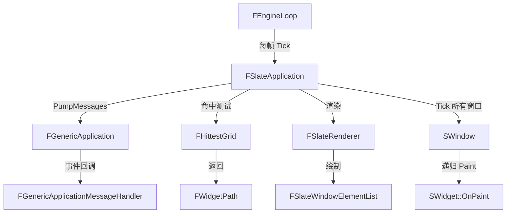

# Slate

## 摘要
引擎跨平台 UI 框架的核心实现，提供窗口管理、控件布局、输入路由、控件反射器等完整桌面 UI 能力。

## 1. 模块定位
Slate 是 UE 的原生 C++ UI 框架。它基于声明式语法构建 UI 控件树，支持即时模式（Immediate Mode）与保留模式（Retained Mode）混合。编辑器界面全部由 Slate 构建，游戏内 UI 则通过 UMG（Slate 的 UObject 封装）实现。Slate 依赖 SlateCore 提供基础控件类和渲染基础设施。

## 2. 所在路径
```
Engine/Source/Runtime/Slate/
├── Public/
│   ├── Framework/
│   │   ├── Application/
│   │   │   ├── SlateApplication.h     (核心单例)
│   │   │   ├── SlateUser.h            (用户抽象)
│   │   │   └── IInputProcessor.h      (输入处理接口)
│   │   ├── Docking/
│   │   ├── Layout/
│   │   ├── MultiBox/
│   │   ├── Text/
│   │   └── Views/                     (ListView, TreeView 等)
│   ├── Widgets/
│   │   ├── Layout/
│   │   ├── Input/                     (SButton, SCheckBox 等)
│   │   ├── Text/
│   │   ├── Images/
│   │   └── Navigation/
│   └── SlateSharedPCH.h
├── Private/
└── Slate.Build.cs
```

## 3. Build.cs 依赖关系
```csharp
// Slate.Build.cs
PublicDependencyModuleNames = {
    "Core", "CoreUObject", "InputCore",
    "Json", "SlateCore", "ImageWrapper",
    "ApplicationCore"  // 条件依赖
};
PrivateDependencyModuleNames = { "TraceLog" };
// 第三方: AHEasing (缓动函数库)
// 运行时依赖: Content/Slate/*.ttf, *.png, *.svg 字体和图标资源
```

## 4. Public API（7个关键类）

| 类 | 文件 | 职责 |
|----|------|------|
| `FSlateApplication` | Framework/Application/SlateApplication.h | 全局 UI 单例，消息泵、Tick、窗口管理 |
| `FSlateUser` | Framework/Application/SlateUser.h | 多用户输入/焦点抽象 |
| `SWindow` | Widgets/SWindow.h | 顶层窗口控件 |
| `SPanel` | Widgets/Layout/SPanel.h | 面板布局基类 |
| `SCompoundWidget` | Widgets/SCompoundWidget.h | 复合控件基类（可拥有子控件） |
| `FWidgetPath` | Widgets/SWidgetPath.h | 控件路径（从窗口到目标的命中测试路径） |
| `IInputProcessor` | Framework/Application/IInputProcessor.h | 输入预处理接口 |

## 5. 关键函数（含文件路径）

### 5.1 FSlateApplication::Tick()
```cpp
// Framework/Application/SlateApplication.h
virtual void Tick(FTimespan DeltaTime) override;
```
每帧调用，处理延迟动作、更新动画、重绘所有窗口。

### 5.2 FSlateApplication::PumpMessages()
```cpp
virtual void PumpMessages(const float DeltaTime) override;
```
从 ApplicationCore 拉取平台消息，分发到 FSlateUser。

### 5.3 FSlateApplication::ProcessInputEvent()
将 `FInputEvent` 路由到焦点控件，通过 `FWidgetPath` 进行冒泡/隧道。

### 5.4 FSlateApplication::FindWidgetUnderMouse()
命中测试：通过 `FHittestGrid` 找到鼠标位置下的最深层控件。

### 5.5 FSlateApplication::AddWindow()
创建并注册顶层 `SWindow`，开始接收输入和渲染。

## 6. 初始化流程
```cpp
// 使用 FDefaultModuleImpl
// FSlateApplication 由引擎初始化代码显式创建:
// 1. FSlateApplication::Create() — 创建单例
// 2. FSlateApplication::InitializeRenderer() — 绑定 SlateRenderer
// 3. CreateStartupWindow() — 创建主窗口
// 4. 每帧 Tick() 由 FEngineLoop 驱动
```

## 7. 与其他模块的关系
```
ApplicationCore (平台消息)
  └──> SlateCore (SWidget, 渲染基础设施)
         └──> Slate (FSlateApplication, 窗口, 控件库)
                ├──被依赖──> UMG (UWidget 包装 SWidget)
                ├──被依赖──> Editor 模块 (编辑器 UI)
                └──被依赖──> SlateRHIRenderer (GPU 渲染后端)
```

## 8. 常见扩展点
- **自定义控件**：继承 `SCompoundWidget`，实现 `Construct()` 和 `OnPaint()`
- **输入预处理**：实现 `IInputProcessor`，调用 `FSlateApplication::RegisterInputPreProcessor()`
- **自定义布局**：继承 `SPanel`，实现 `OnArrangeChildren()` 和 `ComputeDesiredSize()`
- **样式定制**：通过 `FSlateStyleSet` 注册自定义画刷和字体

## 9. Mermaid 调用图


## 10. 源码证据
- `Slate.Build.cs:12-20`：公共依赖含 SlateCore、InputCore、ApplicationCore
- `Public/Framework/Application/SlateApplication.h`：核心单例类
- `Public/Framework/Application/IInputProcessor.h`：输入预处理接口
- 运行时资源依赖：`Content/Slate/*.ttf` 字体、`*.png` 图标（Build.cs:43-48）
- AHEasing 缓动库集成（Build.cs:67）

## 11. 相关文档
- `UE5_知识树.txt` — A.核心层 / Slate 模块
- Epic 官方文档: Slate UI Framework
