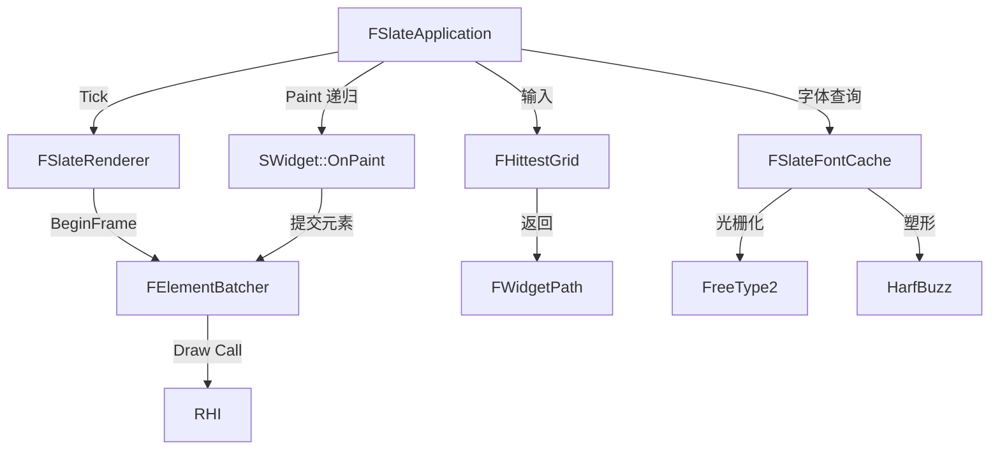

# SlateCore

## 摘要
Slate UI 框架的基础设施层：定义 SWidget 控件基类、布局/命中测试/渲染管线、字体缓存和输入事件系统。

## 1. 模块定位
SlateCore 是 Slate 的底层模块，提供所有 UI 控件的基类 `SWidget`、控件树结构 `FChildren`、布局几何 `FGeometry`、渲染批处理 `FElementBatcher`、命中测试网格 `FHittestGrid`、字体缓存 `FSlateFontCache` 等。它不包含具体控件实现，只提供基础设施。

## 2. 所在路径
```
Engine/Source/Runtime/SlateCore/
├── Public/
│   ├── Widgets/          (SWidget 基类)
│   ├── Application/      (FSlateApplicationBase)
│   ├── Rendering/        (FSlateRenderer, FElementBatcher)
│   ├── Fonts/            (FSlateFontCache)
│   ├── Input/            (FKeyEvent, FPointerEvent 等)
│   ├── Layout/           (FGeometry, FChildren)
│   ├── Brushes/          (FSlateBrush)
│   ├── Styling/          (FSlateStyleSet)
│   ├── Animation/        (缓动曲线)
│   ├── Types/            (基础类型)
│   └── Text/             (文本布局引擎)
├── Private/
└── SlateCore.Build.cs
```

## 3. Build.cs 依赖关系
```csharp
// SlateCore.Build.cs
PublicDependencyModuleNames = {
    "Core", "CoreUObject", "DeveloperSettings",
    "InputCore", "Json", "TraceLog",
    "ApplicationCore"  // 条件依赖
};
// 第三方库（非 Server 构建）:
//   FreeType2 — 字体光栅化
//   HarfBuzz — 文字塑形（复杂脚本）
//   Nanosvg — SVG 矢量图渲染
//   ICU — 国际化文本处理
```

## 4. Public API（8个关键类）

| 类 | 文件 | 职责 |
|----|------|------|
| `SWidget` | Public/Widgets/SWidget.h | 所有 UI 控件基类，定义 Paint/HitTest/Layout 接口 |
| `FSlateApplicationBase` | Public/Application/SlateApplicationBase.h | FSlateApplication 的基类 |
| `FSlateRenderer` | Public/Rendering/SlateRenderer.h | 渲染后端抽象（SlateRHIRenderer 实现） |
| `FSlateFontCache` | Public/Fonts/SlateFontCache.h | 字形缓存与纹理图集管理 |
| `FChildren` | Public/Layout/Children.h | 控件子节点容器接口 |
| `FGeometry` | Public/Layout/Geometry.h | 控件的绝对/局部位置与大小 |
| `FElementBatcher` | Public/Rendering/ElementBatcher.h | 将绘制指令批处理提交给 GPU |
| `FHittestGrid` | Public/HittestGrid.h | 空间索引网格，加速命中测试 |

## 5. 关键函数（含文件路径）

### 5.1 SWidget::OnPaint()
```cpp
// Public/Widgets/SWidget.h
virtual int32 OnPaint(const FPaintArgs& Args, const FGeometry& AllottedGeometry,
    const FSlateRect& MyCullingRect, FSlateWindowElementList& OutDrawElements,
    int32 LayerId, const FWidgetStyle& InWidgetStyle, bool bParentEnabled) const;
```
核心绘制虚函数，子类重写以提交渲染元素。

### 5.2 SWidget::ComputeDesiredSize()
```cpp
virtual FVector2D ComputeDesiredSize(float LayoutScaleMultiplier) const = 0;
```
纯虚函数，控件返回期望大小（Slate 布局系统调用）。

### 5.3 SWidget::OnKeyDown() / OnMouseButtonDown()
输入事件虚函数，控件重写以响应键盘/鼠标输入。

### 5.4 FElementBatcher::AddElements()
将控件的绘制元素（文本、图片、线框等）合批，减少 Draw Call。

### 5.5 FHittestGrid::GetWidgetPath()
从鼠标坐标出发，沿着命中测试网格找到控件路径 `FWidgetPath`。

## 6. 初始化流程
```cpp
// FDefaultModuleImpl，无自定义 Startup
// 字体缓存由 FSlateApplication::Create() 时初始化:
// 1. FSlateFontCache::Create() — 创建字形缓存
// 2. FFreeTypeFontCache — 绑定 FreeType 光栅化器
// 3. FHittestGrid::Clear() — 每帧清空命中网格
```

## 7. 与其他模块的关系
```
ApplicationCore (窗口/输入接口)
  └──> SlateCore (SWidget 基类, 渲染, 字体)
         └──> Slate (FSlateApplication, 控件库)
                └──> UMG (UObject 封装)
```
- **FreeType2**：字符光栅化
- **HarfBuzz**：复杂脚本排版（阿拉伯语、印地语等）
- **ICU**：断词、双向文本
- **Nanosvg**：SVG 矢量图标渲染

## 8. 常见扩展点
- **自定义控件**：继承 `SWidget` 或 `SCompoundWidget`
- **自定义布局**：继承 `SPanel`，实现 `ArrangeChildren()`
- **渲染后端**：继承 `FSlateRenderer`（如 `FSlateRHIRenderer`）
- **字体提供者**：扩展 `FSlateFontCache` 的字体查找逻辑

## 9. Mermaid 调用图


## 10. 源码证据
- `SlateCore.Build.cs:13-21`：公共依赖含 Core、CoreUObject、InputCore、ApplicationCore
- `SlateCore.Build.cs:30-46`：FreeType2/HarfBuzz/Nanosvg/ICU 第三方库绑定
- `Public/Widgets/SWidget.h`：控件基类，约 2000+ 行的纯虚接口
- `Public/Rendering/ElementBatcher.h`：渲染批处理器
- `Public/HittestGrid.h`：空间命中测试网格

## 11. 相关文档
- `UE5_知识树.txt` — A.核心层 / SlateCore 模块
- Epic 官方文档: Slate Core Architecture
