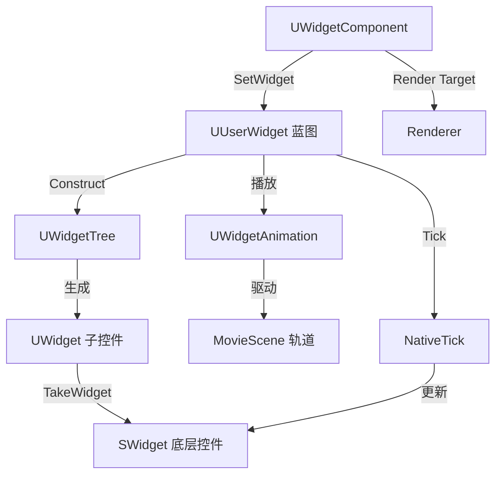

# UMG

## 摘要
Slate UI 框架的 UObject 封装层，提供蓝图可编辑的 Widget 控件系统、Widget Component（3D 空间 UI）和 Widget Animation。

## 1. 模块定位
UMG (Unreal Motion Graphics) 将 Slate 的 C++ 控件包装为 `UWidget`（UObject 子类），使控件可在蓝图/编辑器中可视化编辑。`UUserWidget` 是核心容器类，开发者通过蓝图继承它构建游戏 UI。`UWidgetComponent` 将 UI 渲染到 3D 空间的渲染目标上，实现世界空间 UI。

## 2. 所在路径
```
Engine/Source/Runtime/UMG/
├── Public/
│   ├── Components/        (UButton, UImage, UPanelWidget 等)
│   ├── Blueprint/         (UWidgetTree, UWidgetAnimation)
│   ├── Animation/         (UMG 动画系统)
│   ├── Slot/              (UPanelSlot 子类)
│   └── UObject/           (UUserWidget)
├── Private/
│   ├── Components/
│   ├── Animation/
│   └── UMGModule.cpp
└── UMG.Build.cs
```

## 3. Build.cs 依赖关系
```csharp
// UMG.Build.cs
PrivateDependencyModuleNames = {
    "Core", "CoreUObject", "Engine", "InputCore",
    "Slate", "SlateCore", "RenderCore", "Renderer",
    "RHI", "ApplicationCore", "SlateRHIRenderer"
};
PublicDependencyModuleNames = {
    "FieldNotification", "HTTP", "MovieScene",
    "MovieSceneTracks", "PropertyPath", "TimeManagement"
};
// 私有包含: SlateRHIRenderer, ImageWrapper, TargetPlatform
```

## 4. Public API（9个关键类）

| 类 | 职责 |
|----|------|
| `UUserWidget` | 核心容器类，蓝图继承入口，持有 `UWidgetTree` |
| `UWidget` | 所有 UMG 控件的 UObject 基类，内部持有 `SWidget` |
| `UWidgetTree` | 控件树，管理父子关系和序列化 |
| `UWidgetAnimation` | UMG 动画资源，基于 MovieScene |
| `UWidgetComponent` | 3D 空间 UI 渲染组件 |
| `UPanelWidget` | 容器控件基类（如 Canvas, Grid, VerticalBox） |
| `UPanelSlot` | 子控件在父容器中的布局槽 |
| `UButton` | 按钮控件 |
| `UImage` | 图片控件 |

## 5. 关键函数（含文件路径）

### 5.1 UUserWidget::GetWorld()
```cpp
// 重写 UObject::GetWorld()，返回所属 PlayerController 的 World
virtual UWorld* GetWorld() const override;
```

### 5.2 UWidgetTree::FindWidget()
```cpp
// 按名称/类型在控件树中查找子控件
UWidget* FindWidget(const FString& Name) const;
template<typename WidgetT> WidgetT* FindWidget(const FString& Name) const;
```

### 5.3 UWidget::GetFriendlyName()
返回控件的蓝图可读名称，用于调试和反射。

### 5.4 UUserWidget::NativeTick()
```cpp
// 每帧调用，蓝图可重写 Tick
virtual void NativeTick(const FGeometry& MyGeometry, float InDeltaTime) override;
```

### 5.5 UWidgetComponent::SetWidget()
设置该组件渲染的 `UUserWidget` 实例。

## 6. 初始化流程
```cpp
// UMGModule.cpp
class FUMGModule : public IModuleInterface {
    virtual void StartupModule() override {
        #if WITH_EDITOR
        // 加载 UMGEditor 模块
        FModuleManager::LoadModule("UMGEditor");
        #endif
    }
};
IMPLEMENT_MODULE(FUMGModule, UMG);
```

## 7. 与其他模块的关系
```
SlateCore (SWidget 基类)
  └──> Slate (FSlateApplication, 控件库)
         └──> UMG (UWidget 封装 SWidget)
                ├──> MovieScene (UWidgetAnimation 底层)
                ├──> Renderer (UWidgetComponent 渲染到纹理)
                └──> Engine (UActorComponent 继承)
```

## 8. 常见扩展点
- **自定义 UMG 控件**：继承 `UWidget`，在 `TakeWidget()` 中返回自定义 `SWidget`
- **自定义 Panel**：继承 `UPanelWidget`，实现自定义布局算法
- **Widget Animation**：通过 `UWidgetAnimation` 和 MovieScene 轨道驱动属性动画
- **3D UI**：使用 `UWidgetComponent` 将 UI 放置到世界空间

## 9. Mermaid 调用图


## 10. 源码证据
- `UMG.Build.cs:9-24`：私有依赖包含完整 Slate 栈 + Renderer + RHI
- `UMG.Build.cs:26-35`：公共依赖含 MovieScene、MovieSceneTracks（动画系统）
- `UMG.Build.cs:55-58`：非 Server 构建额外依赖 SlateRHIRenderer
- `UUserWidget`：重写 `GetWorld()` 关联到 PlayerController 的 World 上下文

## 11. 相关文档
- `UE5_知识树.txt` — A.核心层 / UMG 模块
- Epic 官方文档: UMG UI Designer
