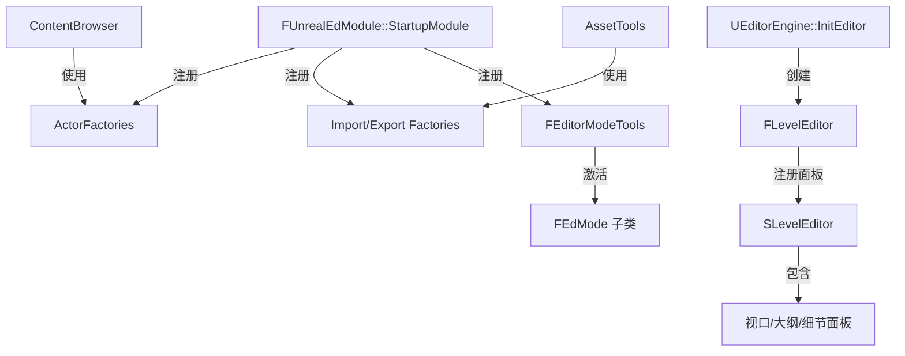

# UnrealEd

## 摘要
编辑器核心模块：提供关卡编辑器、编辑器模式工具、资产导入/导出工厂、Actor 工厂、编辑器设置和编辑器引擎等核心编辑器功能。

## 1. 模块定位
UnrealEd 是引擎编辑器的核心模块，仅在 Editor 构建中编译。它包含 `UEditorEngine`（编辑器引擎扩展）、`FEditorModeTools`（编辑模式管理：平移/旋转/缩放/画刷）、`FLevelEditor`（关卡编辑器面板）、导入导出工厂（`UExporter`/`UFactory`）、Actor 工厂（`UActorFactory`）、缩略图渲染等。几乎所有编辑器模块都直接或间接依赖 UnrealEd。

## 2. 所在路径
```
Engine/Source/Editor/UnrealEd/
├── Classes/
│   ├── Editor/
│   │   ├── EditorEngine.h
│   │   └── EditorPerProjectUserSettings.h
│   ├── ActorFactories/
│   ├── Exporters/
│   ├── Factories/
│   ├── Settings/
│   └── ThumbnailRendering/
├── Public/
│   ├── AssetDefinitionDefault.h
│   ├── AssetThumbnail.h
│   ├── ToolMenuContext.h
│   └── ... (大量编辑器工具类)
├── Private/
│   ├── LevelEditor/          (关卡编辑器实现)
│   ├── Mode.cpp/h            (编辑模式)
│   └── ... (大量 .cpp 实现)
└── UnrealEd.Build.cs
```

## 3. Build.cs 依赖关系
```csharp
// UnrealEd.Build.cs (关键部分)
PublicDependencyModuleNames = {
    "Core", "CoreUObject", "Engine", "InputCore",
    "Slate", "SlateCore", "UnrealEd" (循环), ...
};
// 大量编辑器模块的 Private/Dynamic 依赖:
//   StructViewer, MainFrame, GraphEditor, SourceControlWindows,
//   LandscapeEditor, StaticMeshEditor, PlacementMode, ...
// CircularlyReferencedDependentModules 处理循环依赖
```
UnrealEd 是编辑器模块中依赖最复杂的模块之一，与许多编辑器模块有双向依赖。

## 4. Public API（4个关键类）

| 类 | 文件 | 职责 |
|----|------|------|
| `FEditorModeTools` | Public/Mode.h | 编辑模式管理器（变换/画刷/几何体等模式） |
| `FLevelEditor` | Private/LevelEditor.h | 关卡编辑器面板管理 |
| `UEditorEngine` | Classes/Editor/EditorEngine.h | 编辑器模式引擎（继承 UUnrealEdEngine） |
| `UUnrealEdEngine` | Classes/Editor/UnrealEdEngine.h | 编辑器引擎基类 |

## 5. 关键函数

### 5.1 UEditorEngine::InitEditor()
初始化编辑器引擎：创建编辑器窗口、加载关卡编辑器模块、注册编辑模式。

### 5.2 FEditorModeTools::ActivateMode()
激活指定编辑模式（如 FTransformMode、FGeometryMode），更新视口交互。

### 5.3 FLevelEditor 注册关卡编辑器面板
创建并注册 SLevelEditor Slate 控件到主窗口布局。

### 5.4 资产导入/导出工厂
`UFactory::FactoryCreateNew()` — 创建新资产
`UExporter::ExportToFile()` — 导出资产到文件

## 6. 初始化流程
```
1. FUnrealEdModule::StartupModule()
2. 注册所有 ActorFactories
3. 注册所有资产 Factories/Exporters
4. 注册缩略图渲染器
5. 初始化编辑器模式工具
6. 绑定 FLevelEditor 面板到 TabManager
```

## 7. 与其他模块的关系
```
Engine (UEditorEngine 继承 UGameEngine)
  └──> UnrealEd (编辑器核心)
         ├──被依赖──> AssetTools (资产操作)
         ├──被依赖──> ContentBrowser (内容浏览器)
         ├──被依赖──> GraphEditor (蓝图/材质编辑器)
         ├──被依赖──> LevelEditor (关卡编辑面板)
         └──被依赖──> 几乎所有 Editor 模块
```

## 8. 常见扩展点
- **自定义编辑模式**：继承 `FEdMode`，注册到 `FEditorModeTools`
- **自定义 Actor 工厂**：继承 `UActorFactory`，注册拖放到场景的行为
- **自定义导入/导出**：继承 `UFactory`/`UExporter`
- **缩略图渲染**：继承 `FThumbnailRenderer`，自定义资产缩略图

## 9. Mermaid 调用图


## 10. 源码证据
- `UnrealEd.Build.cs:8-9`：非 Editor 构建抛出 BuildException，确认仅编辑器可用
- `UnrealEd.Build.cs:16-17`：PrivatePCHHeaderFile 指向 `UnrealEdPrivatePCH.h`
- `Classes/Editor/EditorEngine.h`：UEditorEngine 定义
- `Classes/ActorFactories/`、`Classes/Exporters/`、`Classes/Factories/`：工厂类集合

## 11. 相关文档
- `UE5_知识树.txt` — D.编辑器层 / UnrealEd 模块
- Epic 官方文档: Unreal Editor Architecture
